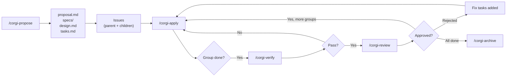
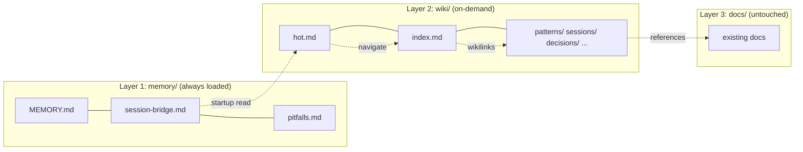

**English** | [繁體中文](README.zh-TW.md)

# 🐕 Coding Corgi Flow

> **Your AI pipeline, structured.**  
> A workflow toolkit that turns any AI coding assistant into a disciplined engineering partner — proposal to archive, tracked and reviewable.

<p align="center">
  
</p>

---

## 🐾 Before & After

<table>
  <tr>
    <td align="center" width="50%"><b>😫 Without Corgi</b></td>
    <td align="center" width="50%"><b>🐕 With Corgi Flow</b></td>
  </tr>
  <tr>
    <td></td>
    <td></td>
  </tr>
  <tr>
    <td align="center">No pipeline. No tracking.<br/>Code spaghetti. Repeated mistakes.</td>
    <td align="center">Schema-driven planning. Issue tracking.<br/>Checkpoint execution. 5-axis review.</td>
  </tr>
</table>

## 🗺️ The Pipeline

<p align="center">
  
</p>

<details>
<summary>Precise diagram (Mermaid)</summary>



</details>

---

## 🔧 What This Is

Coding Corgi Flow is the **community extension** of [OpenSpec](https://github.com/Fission-AI/OpenSpec) by [Fission AI](https://github.com/Fission-AI). We layer custom schemas, AI skills, and CLI tooling on top of OpenSpec's core artifact pipeline to add what real teams need:

| Superpower | Why you need it |
|---|---|
| 📌 **Automatic Issue Tracking** | Parent + child issues on GitLab or GitHub, labels synced |
| 🛑 **Checkpoint-based Apply** | One Task Group at a time — never lose control of your AI |
| ✅ **Automated Verify Gate** | Lint, build, tests, spec coverage — blocks review on failure |
| 🔍 **5-Axis Review** | Architecture · Security · Performance · Quality · Completeness |
| 🧠 **Cross-Session Memory** | 3-layer system — your AI remembers across sessions (≤3000 tokens at startup) |
| 🌿 **Worktree Isolation** | Parallel changes, each in its own git worktree (opt-in) |
| 🧩 **Composable Skills** | Atoms → Molecules → Compounds with validated metadata |
| 📦 **One-command Install** | `npm i -g corgispec` → `corgispec bootstrap` → done |

It ships as an npm CLI (`corgispec`), a Claude Code / Codex plugin, and a set of slash commands for OpenCode, Claude Code, and Codex.

---

## 🚀 Quick Start

### Prerequisites

- **Node.js 18+**
- **An LLM Agent** — OpenCode, Claude Code, Cursor, AmpCode, etc.
- **`gh` CLI** (for GitHub) or **`glab` CLI** (for GitLab)

### Install & Bootstrap

Choose your path:

**A. npm (recommended)**

```bash
npm install -g corgispec
corgispec bootstrap --path /path/to/your-project --schema github-tracked
```

**B. Claude Code / Codex Plugin**

```text
# Claude Code
/plugin marketplace add ricoyudog/Coding_Corgi_flow
/plugin install corgispec@corgispec

# Codex
codex plugin install corgispec
```

**C. Bootstrap via AI Agent**

Paste this into your agent:

```text
Fetch and follow instructions from https://raw.githubusercontent.com/ricoyudog/Coding_Corgi_flow/main/.opencode/INSTALL.md
```

### Initialize Memory (recommended)

```text
# OpenCode
/corgi-memory-init

# Claude Code
/corgi:memory-init
```

### Start Building

```text
# OpenCode
/corgi-propose Add user authentication with JWT and refresh tokens

# Claude Code
/corgi:propose Add user authentication with JWT and refresh tokens
```

Then: `apply` → `verify` → `review` → `archive`. One Task Group at a time.

---

## 🎮 Commands

| Command | What it does |
|---|---|
| `/corgi-propose` | Generate planning artifacts (proposal, specs, design, tasks) + create issues |
| `/corgi-apply` | Execute one Task Group, sync closeout, pause for review |
| `/corgi-verify` | Automated quality gate — lint, build, tests, spec coverage |
| `/corgi-review` | 5-axis review with evidence gathering, approve/reject/discuss |
| `/corgi-archive` | Close issues, sync delta specs, extract knowledge, cleanup |
| `/corgi-explore` | Thinking partner — explore ideas, clarify requirements |
| `/corgi-install` | Project-local asset install, update, or verify |
| `/corgi-memory-init` | Initialize 3-layer memory (`memory/` + `wiki/`) |
| `/corgi-migrate` | Import existing knowledge into memory/wiki |
| `/corgi-lint` | 11-check memory health validation |
| `/corgi-ask` | Answer questions from the vault with budget-aware retrieval |

> Claude Code uses `/corgi:<command>` syntax (e.g., `/corgi:propose`). Platform auto-detected from `config.yaml`.

---

## ✨ Feature Showcase

<table>
  <tr>
    <td width="50%">
      <b>📋 Checkpoint-based Apply</b><br/>
      One Task Group at a time, pauses for review — never lose control.
      <br/><br/>
      
    </td>
    <td width="50%">
      <b>📌 Automatic Issue Tracking</b><br/>
      Parent + child issues on GitLab or GitHub, labels synced automatically.
      <br/><br/>
      
    </td>
  </tr>
  <tr>
    <td>
      <b>✅ Task Management</b><br/>
      Tasks broken into groups with clear checklist tracking.
      <br/><br/>
      
    </td>
    <td>
      <b>🔍 5-Axis Review</b><br/>
      Architecture · Security · Performance · Quality · Completeness.
      <br/><br/>
      
    </td>
  </tr>
</table>

---

## 🧠 Cross-Session Memory

AI sessions are stateless by default. Corgi Flow adds a **3-layer memory system** that persists knowledge across sessions — ≤2900 tokens at startup, self-compacting, Obsidian-compatible.

<p align="center">
  
</p>

<details>
<summary>Precise diagram (Mermaid)</summary>



</details>

> 📸 See it in action: 

| Scenario | Command |
|---|---|
| New project | Paste Quick Start prompt → `corgispec bootstrap` |
| Add memory to existing | `/corgi-memory-init` |
| Migrate existing KB | `/corgi-migrate` |
| Health check | `/corgi-lint` |

→ **[Full Memory Documentation](docs/cross-session-memory.md)**

---

## 🧩 Skill Architecture

Skills are organized in a **composable 3-tier hierarchy**:

<p align="center">
  
</p>

| Tier | Role | Dependencies |
|---|---|---|
| **Atom** | Single reusable operation (resolve config, parse tasks) | None |
| **Molecule** | Workflow combining atoms (propose, apply, review) | Atoms only |
| **Compound** | End-to-end orchestration (the full pipeline) | Molecules only |

Each skill has two files:
- `SKILL.md` — AI-readable instructions
- `skill.meta.json` — Machine-readable metadata (tier, deps, platform, version)

Validate and visualize with the `ds-skills` CLI:

```bash
cd tools/ds-skills && npm install
node bin/ds-skills.js validate --path ../..    # schema + tier + cycle checks
node bin/ds-skills.js graph --path ../..        # dependency graph (Mermaid)
node bin/ds-skills.js list --path ../.. --tier atom --platform github
```

---

## 📐 Schemas

A schema defines the artifact pipeline. Both bundled schemas (`gitlab-tracked`, `github-tracked`) produce the same 4-artifact pipeline:

| Artifact | File | Purpose |
|---|---|---|
| **Proposal** | `proposal.md` | Motivation, scope, capabilities, impact |
| **Specs** | `specs/<capability>/spec.md` | Formal WHEN/THEN scenarios (one per capability) |
| **Design** | `design.md` | Technical decisions, architecture, risks, trade-offs |
| **Tasks** | `tasks.md` | Numbered Task Groups with checkboxes — each becomes a child issue |

Pipeline: `proposal → specs → design → tasks → apply`

Key decisions:
- **Capability-driven specs** — one spec file per capability, traceable contracts
- **Delta spec model** — ADDED/MODIFIED/REMOVED/RENAMED operations accumulate into canonical specs
- **Task Groups as checkpoints** — each `## N. Group` = one child issue, one apply session, one review cycle

<details>
<summary>Creating a custom schema</summary>

Create `openspec/schemas/my-schema/`:

```
my-schema/
├── schema.yaml
└── templates/
    ├── proposal.md
    └── tasks.md
```

`schema.yaml`:

```yaml
name: my-schema
version: 1
description: Lightweight workflow with proposal and tasks

artifacts:
  - id: proposal
    generates: proposal.md
    description: What and why
    template: proposal.md
    instruction: |
      Write the proposal explaining the change motivation and scope.
    requires: []

  - id: tasks
    generates: tasks.md
    description: Implementation checklist
    template: tasks.md
    instruction: |
      Break implementation into numbered Task Groups with checkboxes.
    requires:
      - proposal

apply:
  requires:
    - tasks
  tracks: tasks.md
  instruction: |
    Execute one Task Group at a time. Mark tasks as [x] when done.
```

Set `schema: my-schema` in `config.yaml`.

</details>

---

## ⚖️ Vanilla OpenSpec vs. Corgi Flow

| Capability | Vanilla OpenSpec | Coding Corgi Flow |
|---|---|---|
| Issue tracking | None | Parent/child issues via `gh` or `glab` |
| Apply behavior | All tasks at once | Checkpoint-based: one group, pause, review |
| Progress sync | Local checkboxes only | Rich summaries posted to issues |
| Workflow labels | None | `backlog → todo → in-progress → review → done` |
| Review | None | 5-axis automated checks + verify gate + decision loop |
| Spec format | Generic | Delta ops (ADDED/MODIFIED/REMOVED/RENAMED) |
| Worktree isolation | None | Opt-in parallel dev via git worktrees |
| Cross-session memory | None | 3-layer system with self-compaction |
| Knowledge migration | None | Guided import from docs, archives, vault pages |
| Memory health | None | 11-check lint (freshness, caps, links, extraction) |
| Skill architecture | Flat files | Atoms → Molecules → Compounds with schema validation |
| Plugin marketplace | None | Claude Code `/plugin install` + Codex marketplace |

---

## ⚙️ Configuration

All settings live in `openspec/config.yaml`:

```yaml
schema: github-tracked       # or gitlab-tracked

# Optional: worktree isolation for parallel changes
isolation:
  mode: worktree             # worktree | none (default: none)
  root: .worktrees
  branch_prefix: feat/

# Optional: project context for AI-generated artifacts
context: |
  Tech stack: TypeScript, Next.js 14, Prisma, PostgreSQL
  Domain: e-commerce platform

# Optional: per-artifact rules
rules:
  proposal:
    - Keep proposals under 500 words
  tasks:
    - Max 2 hours per task
```

The installer manages only the `schema` and `isolation` keys. Add `context` and `rules` yourself.

For full install/update/verify reference (fresh install, managed update, local modifications, legacy migration), see [Install / Update / Verify Workflow](#-install--update--verify-reference) below.

---

## 📂 Repository Layout

```
schemas/
└── skill-meta.schema.json            # JSON Schema for skill validation

packages/corgispec/                   # Unified CLI (npm publishable)
├── src/                              # TypeScript source
├── dist/                             # Built output
└── assets/                           # Bundled assets

tools/ds-skills/                      # Skill CLI (legacy, use corgispec)
├── bin/ds-skills.js
├── lib/{loader,validate,list,graph}.js
└── tests/

docs/
├── articles/                         # Comics, screenshots, publish kits
│   └── images/                       # Feature screenshots
├── plans/                            # Design & planning documents
└── specs/                            # Feature design specs

openspec/
├── config.yaml
├── schemas/{gitlab,github}-tracked/  # Schema definitions + templates
├── specs/                            # Accumulated canonical specs
└── changes/                          # Active change directories

.opencode/
├── skills/corgispec-*/               # Source of truth: SKILL.md + skill.meta.json
└── commands/corgi-*.md               # Slash command dispatch

.claude/
├── skills/corgispec-*/               # Claude Code skill mirrors
├── commands/corgi/                   # Claude slash command dispatch
└── settings.json                     # Team auto-install config

.claude-plugin/                       # Claude Code Plugin manifest
.codex-plugin/                        # Codex Plugin manifest
.codex/skills/corgispec-*/           # Codex skill symlinks → .claude/skills/
```

---

## 📖 Docs

| Article | Lang | Description |
|---|---|---|
| [Cross-Session Memory](docs/cross-session-memory.md) | EN / [中文](docs/cross-session-memory.zh-TW.md) | Architecture, lifecycle, migration |
| [OpenSpec 落地 GitHub](docs/superpowers/articles/2026-04-28-corgispec-github-workflow-zhihu.md) | 中文 | Spec → Issue → Review → Git pipeline integration |

---

## 🤝 Contributing

1. Fork and clone
2. Create or update a skill under `.opencode/skills/`
3. Each skill needs `SKILL.md` (AI instructions) + `skill.meta.json` (metadata)
4. Validate: `node tools/ds-skills/bin/ds-skills.js validate --path .`
5. Test locally, then submit a PR
6. Sync changes across `.opencode/skills/`, `.claude/skills/`, and `.codex/skills/`

---

## 🔧 Install / Update / Verify Reference

The installer supports four modes:

### Fresh Install

The target project has no managed files yet:

```text
/corgi-install --mode fresh --path /path/to/your-project
```

Copies managed files to `.opencode/`, `.claude/`, `openspec/schemas/`, patches `config.yaml` minimally, writes install manifest and report.

### Managed Update

The project already has `openspec/.corgi-install.json`:

```text
/corgi-install --mode update --path /path/to/your-project
```

If local modifications are detected, the installer prints a diff, stops, and asks for manual resolution — it never silently overwrites your changes.

### Verify-Only

Health check without mutations:

```text
/corgi-install --mode verify --path /path/to/your-project
```

### Legacy Migration

If managed files exist but no install manifest, the installer classifies it as legacy, creates backups, and asks for confirmation before migrating.

---

## 🙏 Acknowledgments

Built on [OpenSpec](https://github.com/Fission-AI/OpenSpec) by [Fission AI](https://github.com/Fission-AI). The core CLI, artifact pipeline engine, and change lifecycle are all OpenSpec — we extend it with custom schemas, AI skills, issue tracking, memory, and review automation.

If you find this useful, please ⭐ [OpenSpec](https://github.com/Fission-AI/OpenSpec) too.

---

## 📸 Image Credits

- **Hero Banner** & **Pipeline Illustration** & **Architecture Diagram** & **Memory Vault** — AI-generated via the [README visual upgrade plan](wiki/decisions/readme-visual-upgrade.md)
- **Corgi Comics** (chaos, confident, journey, knowledge) — AI-generated, prompts in [comic workflow guide](docs/articles/corgi-comic-workflow.md)
- **Feature Screenshots** — from real usage of Coding Corgi Flow on GitHub/GitLab projects
