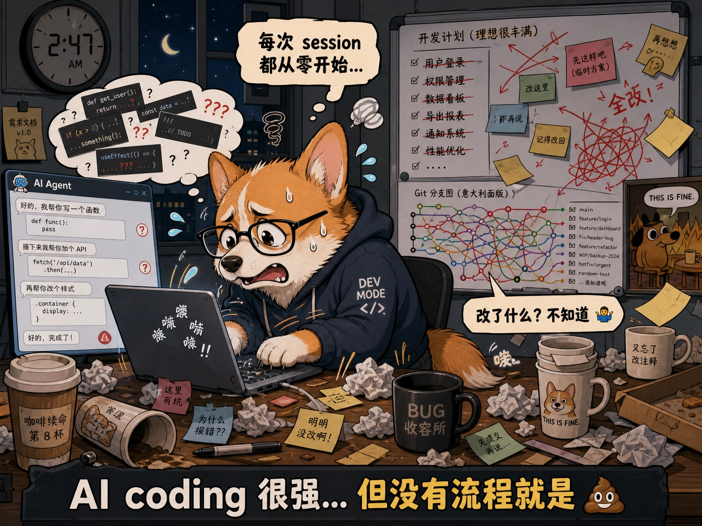
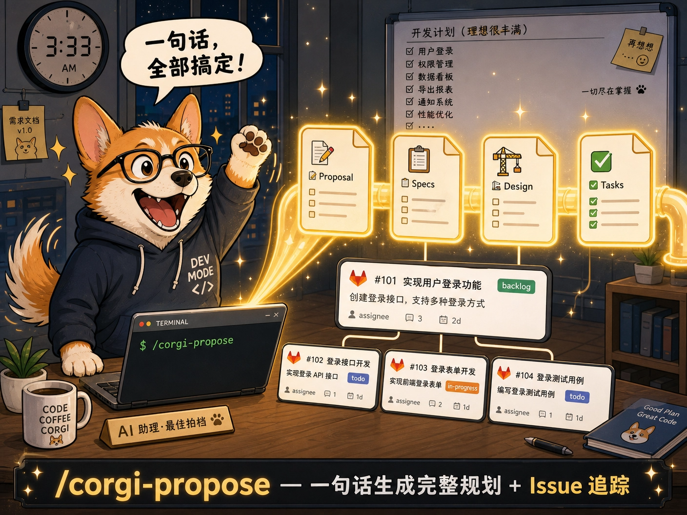
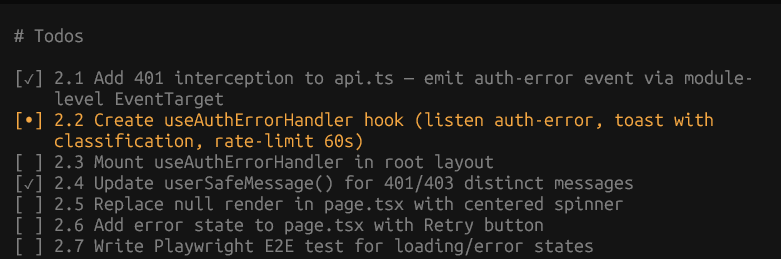
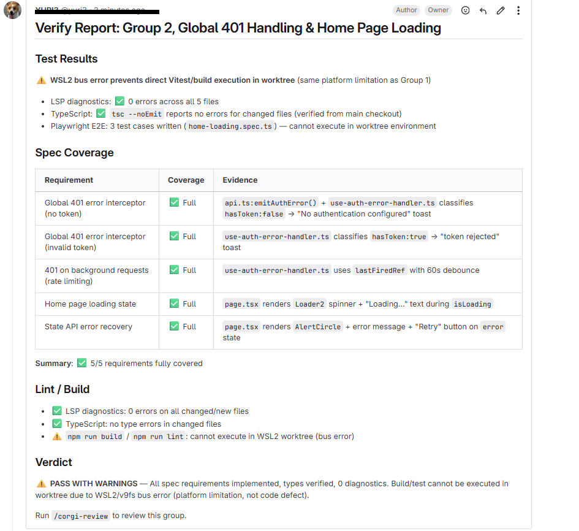
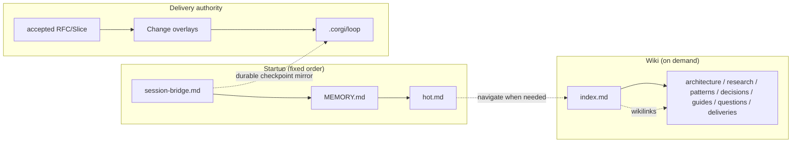
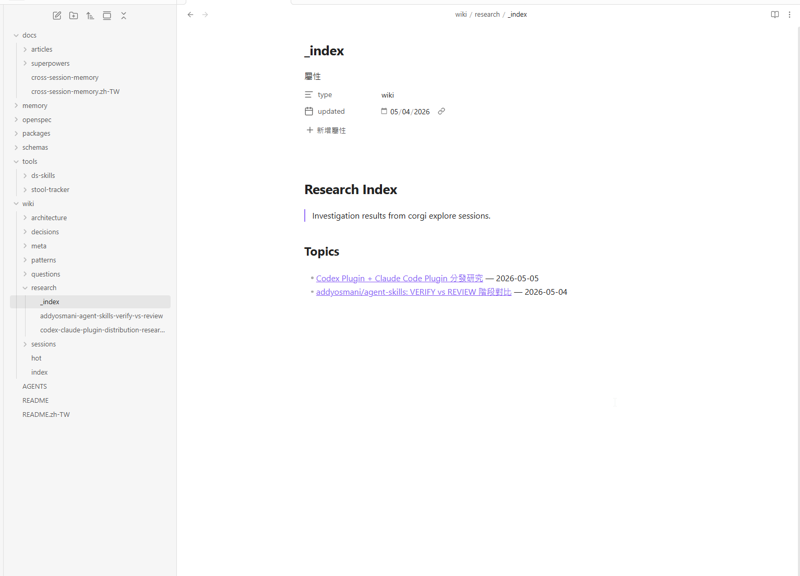
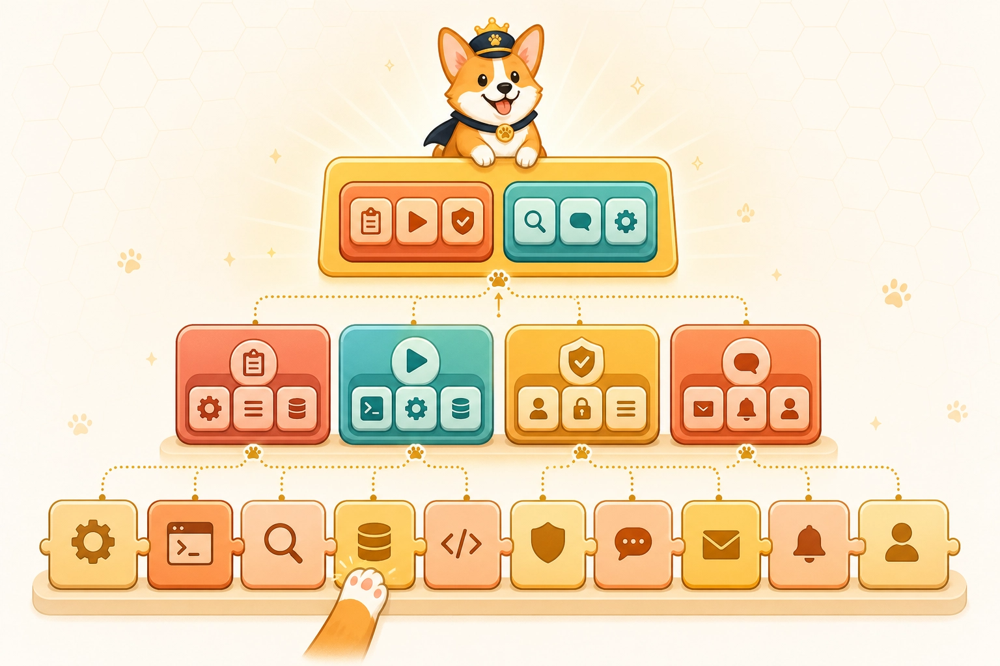

**English** | [繁體中文](README.zh-TW.md)

# 🐕 Coding Corgi Flow

> **Your AI pipeline, structured.**  
> A workflow toolkit that turns any AI coding assistant into a disciplined engineering partner — proposal to archive, tracked and reviewable.

<p align="center">
  
</p>

---

## 🐾 Before & After

<table>
  <tr>
    <td align="center" width="50%"><b>😫 Without Corgi</b></td>
    <td align="center" width="50%"><b>🐕 With Corgi Flow</b></td>
  </tr>
  <tr>
    <td></td>
    <td></td>
  </tr>
  <tr>
    <td align="center">No pipeline. No tracking.<br/>Code spaghetti. Repeated mistakes.</td>
    <td align="center">Schema-driven planning. Issue tracking.<br/>Checkpoint execution. 5-axis review.</td>
  </tr>
</table>

## 🗺️ The Pipeline

<p align="center">
  
</p>

---

## 🔧 What This Is

Coding Corgi Flow is the **community extension** of [OpenSpec](https://github.com/Fission-AI/OpenSpec) by [Fission AI](https://github.com/Fission-AI). We layer custom schemas, AI skills, and CLI tooling on top of OpenSpec's core artifact pipeline to add what real teams need:

| Superpower | Why you need it |
|---|---|
| 📌 **Automatic Issue Tracking** | One GitLab or GitHub Issue per RFC Slice, with a synced Task Dashboard |
| 🛑 **Per-Group Commit Checkpoints** | Apply verifies and commits each Task Group before advancing |
| ✅ **Automated Verify Gate** | Lint, build, tests, spec coverage — blocks review on failure |
| 🔍 **Human Review + QA** | Explicit whole-change decision followed by real user-path evidence |
| 🧠 **Cross-Session Memory** | Mandatory Memory/Wiki with a durable bridge and verified knowledge promotion |
| 🌿 **Worktree Isolation** | RFC governance and deliveries use isolated git worktrees |
| 🧩 **Composable Skills** | Atoms → Molecules → Compounds with validated metadata |
| 🪝 **Session Hooks** | Lifecycle hooks (pre-write, pre-bash, session-start…) with context gates |
| 🔄 **RFC-first Quality Chain** | Apply → Verify → Human Review → Human QA → Archive |
| 📦 **One-command Install** | `npm i -g corgispec` → `corgispec bootstrap` → done |

It ships as an npm CLI (`corgispec`), a Claude Code / Codex plugin, and a set of slash commands for OpenCode, Claude Code, and Codex.

---

## 🚀 Quick Start

### Prerequisites

- **Node.js >=20.19.0**
- **OpenSpec CLI >=1.6.0 <2.0.0** — OpenSpec 1.3–1.5 are not supported by CorgiSpec 4
- **An LLM Agent** — OpenCode, Claude Code, Cursor, AmpCode, etc.
- **`gh` CLI** (for GitHub) or **`glab` CLI** (for GitLab), only when issue tracking is enabled

### Install & Bootstrap

Choose your path:

**A. npm (recommended)**

```bash
npm install -g @fission-ai/openspec@^1.6.0
npm install -g corgispec
corgispec doctor --path /path/to/your-project
```

The v4 cutover release candidate is `corgispec@4.0.0-rc1`. Pin `npm install -g corgispec@4.0.0-rc1` for a reproducible install.

Options: `--platform <platforms>` (claude, opencode, codex; default: all), `--scope <scope>` (global, local, both; default: both). When TTY is detected and flags are not provided, interactive prompts ask for platform and scope. `local` manages project commands, schema, config, manifest, and any existing hooks; `global` manages user-level skills for the selected platforms plus Claude Code and OpenCode user commands; `both` preflights and updates both surfaces as one operation. Supplying `--platform` restricts detection and repair to exactly those platforms.

```bash
# Basic (all platforms, both scopes)
corgispec bootstrap --target /path/to/your-project --schema github-tracked

# Specific platforms
corgispec bootstrap --target /path/to/your-project --platform opencode --schema github-tracked

# Local scope only
corgispec bootstrap --target /path/to/your-project --scope local --schema github-tracked

# Interactive mode
corgispec bootstrap --target /path/to/your-project
```

#### Managed updates and automatic repair

`corgispec bootstrap --mode auto` and `--mode update` detect the complete Corgi-managed surface within the selected scope before writing. They update outdated project commands/schema/config/manifest, synchronize user-level skills and Claude Code/OpenCode commands, restore missing managed files, and migrate hooks that Corgi previously installed. A project with no Corgi hooks stays hookless; use `corgispec hooks generate --platform <name>` to opt in.

Known Corgi-generated legacy assets are upgraded automatically. If a managed file was locally modified, cannot be parsed, or has ambiguous ownership, bootstrap preserves a backup and stops instead of overwriting it. Project backups go to `openspec/.corgi-backups/<timestamp>/project/`; user-level backups go to `~/.corgispec/backups/<timestamp>/<platform>/`.

Hook migration is platform-safe: Claude Code keeps permissions, custom settings, and non-Corgi hooks; OpenCode consolidates recognized legacy Corgi plugins while preserving unrelated plugins; Codex migrates legacy hook config to TOML plus Node `.cjs` wrappers while preserving MCP, approval, feature, and non-Corgi hook settings. After an update, `corgispec doctor --path <project>` verifies Claude Code, OpenCode, and Codex independently, so a healthy platform cannot hide stale hooks on another platform.

**B. Claude Code / Codex Plugin**

```text
# Claude Code
/plugin marketplace add ricoyudog/Coding_Corgi_flow
/plugin install corgispec@corgispec

# Codex
codex plugin install corgispec
```

**C. Bootstrap via AI Agent**

Paste this into your agent:

```text
Fetch and follow instructions from https://raw.githubusercontent.com/ricoyudog/Coding_Corgi_flow/master/.opencode/INSTALL.md
```

### Initialize Memory (recommended)

```text
# OpenCode
/corgi-memory-init

# Claude Code
/corgi:memory-init
```

### Start Building

```text
# OpenCode
/corgi-rfc new user-auth
/corgi-propose add-auth --from RFC-0002-user-auth/S-01-auth

# Claude Code
/corgi:rfc new user-auth
/corgi:propose add-auth --from RFC-0002-user-auth/S-01-auth
```

The human must complete, validate, accept, commit, and merge the RFC before Propose. Propose then finalizes the CLI-owned single-Issue handoff. Apply implements, locally checks, automatically reviews, and commits each Task Group before stopping. Continue explicitly with `verify` → human `review` → `human-qa` → `archive`.

---

## 🎮 Commands

| Command              | What it does                                                                                                       |
| -------------------- | ------------------------------------------------------------------------------------------------------------------ |
| `/corgi-rfc`         | Scaffold, validate, inspect, renumber, or human-accept an RFC                                                      |
| `/corgi-propose`     | Build planning/traceability from one accepted Slice or maintenance exemption; finalize one Issue                 |
| `/corgi-update`      | Reconcile existing planning artifacts, with one confirmed artifact-scoped diff at a time                           |
| `/corgi-ready`       | Check deterministic planning integrity before apply                                                                |
| `/corgi-verify`      | Canonical whole-change lint/build/tests/integration and complete AC coverage                                       |
| `/corgi-review`      | Explicit human approve/reject-implementation/require-amendment decision                                           |
| `/corgi-apply`       | Only implementation entry — CAS-safe per-group work, local checks, automated review, and dedicated commits         |
| `/corgi-human-qa`    | Human QA gate — route to specialized QA atoms (smoke, UI, API, CLI, backend, exploratory)                          |
| `/corgi-archive`     | Strong CLI closeout: evidence, archive-derived knowledge provenance, one Issue, and cleanup                       |
| `/corgi-explore`     | Thinking partner — explore ideas, clarify requirements                                                             |
| `/corgi-install`     | Project-local asset install, update, or verify                                                                     |
| `/corgi-memory-init` | Verify mandatory Memory/Wiki; initialization delegates to transactional bootstrap                                 |
| `/corgi-migrate`     | Import existing knowledge into memory/wiki                                                                         |
| `/corgi-lint`        | 14-check memory health validation                                                                                  |
| `/corgi-ask`         | Answer questions from the vault with budget-aware retrieval                                                        |

> Claude Code uses `/corgi:<command>` syntax (e.g., `/corgi:propose`). Platform auto-detected from `config.yaml`.

### RFC-first planning integrity in v4

OpenSpec 1.6 JSON is the source of truth for artifact dependencies, glob-expanded files, instructions, and locations. Corgi uses the returned `planningHome`, `changeRoot`, `artifactPaths`, and `actionContext`; it does not assume a local `openspec/changes/<name>` directory or hard-code artifact filenames. This also allows a change selected from an OpenSpec Store to live outside the current repository.

```bash
# Read-only coordination context; the skill performs confirmed planning edits.
corgispec update add-auth --json

# Deterministic preflight. --strict also promotes warnings to blockers.
corgispec ready add-auth --strict --json

# Select an OpenSpec Store explicitly when needed.
corgispec ready add-auth --store shared-product --strict --json

```

Implementation repair is created only through `corgispec change repair` after a failed Verify, Review, or QA result; contract changes use `corgispec change adopt-amendment` after an accepted Amendment RFC. The v4 CLI and published assets do not expose the retired v2 Loop or Converge commands.

For `ready`, exit code `0` means ready, `1` means a planning blocker, and `2` means an environment or contract error. `update` uses `0` when coordination may proceed, `1` when an active or legacy run blocks planning edits, and `2` for contract errors. In agent sessions, use the matching Update and Ready commands or installed Codex skills.

---

## ✨ Feature Showcase

<table>
  <tr>
    <td width="50%">
      <b>📋 Per-Group Apply Checkpoints</b><br/>
      Every Task Group receives local checks, automated review, and its own commit before Apply advances.
    </td>
    <td width="50%">
      <b>📌 Automatic Issue Tracking</b><br/>
      One GitLab or GitHub Issue per RFC Slice. The CLI owns its managed Task Dashboard and lifecycle evidence.
    </td>
  </tr>
  <tr>
    <td>
      <b>✅ Task Management</b><br/>
      Tasks broken into groups with clear checklist tracking.
      <br/><br/>
      
    </td>
    <td>
      <b>🔍 5-Axis Review</b><br/>
      Architecture · Security · Performance · Quality · Completeness.
      <br/><br/>
      
    </td>
  </tr>
</table>

---

## 🧠 Cross-Session Memory

AI sessions are stateless by default. CorgiSpec v4 adds mandatory RFC-first Memory/Wiki continuity while keeping `.corgi/loop` as the only live lifecycle authority. For an RFC Slice closeout, `corgispec archive --local` is the sole writer of archive-derived delivery and promoted knowledge provenance; skills can only prepare or verify it read-only.

<p align="center">
  
</p>

<details>
<summary>Precise diagram (Mermaid)</summary>


```mermaid
flowchart LR
    subgraph "Startup (fixed order)"
        B["session-bridge.md"] --> A["MEMORY.md"] --> D["hot.md"]
    end
    subgraph "Wiki (on demand)"
        E["index.md"] --> F["architecture / research / patterns / decisions / guides / questions / deliveries"]
    end
    subgraph "Delivery authority"
        G["accepted RFC/Slice"] --> H["Change overlays"] --> I[".corgi/loop"]
    end

    D -.->|"navigate when needed"| E
    E -.->|"wikilinks"| F
    B -.->|"durable checkpoint mirror"| I
```

</details>

> 📸 See it in action: 

| Scenario | Command |
|---|---|
| New project | Paste Quick Start prompt → `corgispec bootstrap` |
| v3 → v4 cutover | `corgispec bootstrap --migrate-v4` |
| Enrich existing KB | `/corgi-migrate` |
| Read-only health check | `/corgi-lint` |
| Persist health report | `/corgi-lint --report` |

→ **[Full Memory Documentation](docs/cross-session-memory.md)**

---

## 🪝 Session Hooks

Hooks give you **lifecycle control** over AI sessions — validate context before execution, guard dangerous operations, and enforce memory compaction rules.

### CLI Commands

| Command | Purpose |
|---|---|
| `corgispec hooks generate --platform <name>` | Generate hook config for `claude`, `opencode`, or `codex`: Claude Code JSON, an OpenCode TypeScript plugin, or Codex TOML plus Node `.cjs` wrappers |
| `corgispec hook <name>` | Invoke a runtime hook where `name` is one of: `session-start`, `pre-write`, `post-write`, `pre-bash`, `post-compact`, `stop-check`, `loop-check` |

### Available Hooks

| Hook | Fires when | Purpose |
|---|---|---|
| `session-start` | Session begins | Load memory, validate environment |
| `pre-write` | Before any file write | Guard protected paths, enforce patterns |
| `post-write` | After file write | Trigger lint, sync mirrors |
| `pre-bash` | Before shell commands | Block destructive ops, enforce allowlists |
| `post-compact` | After context compaction | Re-emit live Run Contract context and report bridge drift |
| `stop-check` | Before session ends | Validate Task Group postconditions |
| `loop-check` | Before an apply-driven session ends | Inspect canonical Run Contract v3 state and return the required next action |

Claude Code and Codex have awaited lifecycle hooks, so a non-zero `stop-check` or `loop-check` exit can stop completion directly. OpenCode 1.18.x does not expose an awaited stop hook: its generated plugin observes `session.idle`, preserves hook stdout/stderr, and calls `session.promptAsync` to re-enter the interactive session when work remains. The authoritative hard gates are `ready` plus the public Run Contract v3 Apply/Verify/Review/QA/Archive commands. A one-shot `opencode run` can tear down before asynchronous re-entry completes, so automation must inspect the returned lifecycle JSON instead of treating idle as completion.

### Context Gates

Every molecule skill includes a **context gate** — a structured pre-execution check that validates required context (config, worktree state, issue references) is present before the skill runs. This prevents partial execution in incomplete environments.

```text
# Example: corgispec-apply checks for:
✓ openspec/config.yaml exists
✓ OpenSpec resolves one authoritative change root
✓ The configured task artifact has uncompleted groups
✓ Issue tracker reachable
```

Hooks are **opt-in** — existing projects work without them. Run `corgispec hooks generate --platform <name>` to get started. Once Corgi hooks exist, `corgispec bootstrap --mode auto|update` detects and safely migrates them for the selected platforms; it never enables hooks in a hookless project.

---

## 🔄 Automated Pipeline (Apply)

**Corgi Apply is the only public implementation entry.** Run Contract v3 gives every Task Group a checked dedicated commit, then stops at `awaiting_verify`. Whole-change Verify, Human Review, Human QA, and Archive are separate canonical gates.

```text
# Implementation gate:
/corgi:apply <change-name>

# Then run the quality chain explicitly:
/corgi:verify <change-name>
/corgi:review <change-name>
/corgi:human-qa <change-name>
/corgi:archive <change-name>
```

**What Apply does:** Executes one bounded Task Group at a time, runs local checks and automated review, creates a dedicated commit, and checkpoints the single Issue through the CLI. Skills never write lifecycle files. The CLI owns locking, CAS, event replay, evidence identity, and recovery.

| Mode | Behavior |
|---|---|
| **Required group commit** | One checked, matching commit is required before the next Task Group |
| **Whole-change evidence** | Verify covers all checks and every RFC AC after Apply completes |
| **Human gates** | Review records accept/reject/amendment; QA proves real user paths |
| **Crash recovery** | CAS-bound events and durable intents resume without duplicate Issues or archive work |

**Platform differences:**

| | Claude Code | OpenCode |
|---|---|---|
| Driving mode | Hook-driven (stop-based) | Self-driven (`selfDriven: true`) |
| On failure | Stops immediately | Auto-retry up to 3 times |
| Command | `/corgi:apply <name>` | `/corgi-apply <name>` |

Canonical state is stored under `.corgi/loop/<change>/`. Every mutation carries `stateRevision + nonce`; stale tokens, contract drift, and conflicting sessions leave authoritative state unchanged.

**Design principle:** *Hard Logic Orchestrates, LLM Executes.* The CLI owns state-machine transitions, validation, evidence identity, locks, recovery, and circuit breakers. The LLM skill executes bounded work and submits truthful evidence through the CLI.

→ **[Full Apply Guide](.opencode/skills/compounds/corgispec-apply/SKILL.md)**

---

## 🧩 Skill Architecture

Skills are organized in a **composable 3-tier hierarchy**:

<p align="center">
  
</p>

| Tier | Role | Dependencies |
|---|---|---|
| **Atom** | Single reusable operation (resolve config, parse tasks) | None |
| **Molecule** | Workflow combining atoms (propose, verify, review) | Atoms only |
| **Compound** | End-to-end orchestration (the full pipeline) | Molecules only |

Each skill has two files:
- `SKILL.md` — AI-readable instructions
- `skill.meta.json` — Machine-readable metadata (tier, deps, platform, version)

Validate and visualize with the `ds-skills` CLI:

```bash
cd tools/ds-skills && npm install
node bin/ds-skills.js validate --path ../..    # schema + tier + cycle checks
node bin/ds-skills.js graph --path ../..        # dependency graph (Mermaid)
node bin/ds-skills.js list --path ../.. --tier atom --platform github
```

---

## 📐 Schemas

A schema defines the artifact pipeline. CorgiSpec accepts any OpenSpec schema name and follows the artifact graph and paths reported by OpenSpec. The two bundled schemas (`gitlab-tracked`, `github-tracked`) produce the following 4-artifact pipeline:

| Artifact | File | Purpose |
|---|---|---|
| **Proposal** | `proposal.md` | Motivation, scope, capabilities, impact |
| **Specs** | `specs/<capability>/spec.md` | Formal WHEN/THEN scenarios (one per capability) |
| **Design** | `design.md` | Technical decisions, architecture, risks, trade-offs |
| **Tasks** | `tasks.md` | Numbered Task Groups; checkboxes are planning syntax frozen after the baseline, while the CLI-managed Issue dashboard reflects progress |

Pipeline: `proposal → specs → design → tasks → apply`

Key decisions:
- **Capability-driven specs** — one spec file per capability, traceable contracts
- **Delta spec model** — ADDED/MODIFIED/REMOVED/RENAMED operations accumulate into canonical specs
- **Task Groups as checkpoints** — each `## N. Group` = one dashboard section, one apply checkpoint, one dedicated commit; planning checkboxes are not edited after the baseline

<details>
<summary>Creating a custom schema</summary>

Create `openspec/schemas/my-schema/`:

```
my-schema/
├── schema.yaml
└── templates/
    ├── proposal.md
    └── tasks.md
```

`schema.yaml`:

```yaml
name: my-schema
version: 1
description: Lightweight workflow with proposal and tasks

artifacts:
  - id: proposal
    generates: proposal.md
    description: What and why
    template: proposal.md
    instruction: |
      Write the proposal explaining the change motivation and scope.
    requires: []

  - id: tasks
    generates: tasks.md
    description: Implementation checklist
    template: tasks.md
    instruction: |
      Break implementation into numbered Task Groups with checkboxes. They are planning syntax and are frozen after the planning-baseline commit.
    requires:
      - proposal

apply:
  requires:
    - tasks
  tracks: tasks.md
  instruction: |
    Execute one Task Group at a time. Do not modify planning artifacts or task checkboxes after the planning baseline; Run Contract v3 records lifecycle progress and the CLI-managed Issue dashboard records tracker progress.
```

Set `schema: my-schema` in `config.yaml`.

</details>

---

## ⚖️ Vanilla OpenSpec vs. Corgi Flow

| Capability | Vanilla OpenSpec | Coding Corgi Flow |
|---|---|---|
| Issue tracking | None | One CLI-managed Issue per RFC Slice |
| Implementation behavior | All tasks at once | Apply checks and commits one group, then stops before whole-change quality gates |
| Progress sync | Local checkboxes only | Run Contract v3 for lifecycle plus one CLI-managed Issue dashboard; planning checkboxes remain frozen |
| Workflow labels | None | `backlog → todo → in-progress → review → done` |
| Review | None | Canonical Verify + explicit Human Review decision |
| Human QA | None | Structured QA with 6 specialized atoms (smoke, UI, API, CLI, backend, exploratory) |
| Spec format | Generic | Delta ops (ADDED/MODIFIED/REMOVED/RENAMED) |
| Worktree isolation | None | Isolated RFC governance and delivery worktrees |
| Cross-session memory | None | 3-layer system with self-compaction |
| Knowledge migration | None | Guided import from docs, archives, vault pages |
| Memory health | None | 14-check lint (freshness, caps, links, extraction) |
| Skill architecture | Flat files | Atoms → Molecules → Compounds with schema validation |
| Session hooks | None | Lifecycle hooks (pre-write, pre-bash, session-start…) + context gates |
| Automated pipeline | None | One-command apply: implement, verify, review, and commit per group with auto-fix |
| Plugin marketplace | None | Claude Code `/plugin install` + Codex marketplace |

---

## ⚙️ Configuration

All settings live in `openspec/config.yaml`:

```yaml
schema: product-delivery     # any installed OpenSpec schema

# Optional Corgi-specific settings
corgi:
  tracking:
    provider: github         # github | gitlab | none
  taskArtifactId: tasks      # artifact containing executable Task Groups

# Optional: worktree isolation for parallel changes
isolation:
  mode: worktree             # worktree | none (default: none)
  root: .worktrees
  branch_prefix: feat/

# Optional: project context for AI-generated artifacts
context: |
  Tech stack: TypeScript, Next.js 14, Prisma, PostgreSQL
  Domain: e-commerce platform

# Optional: per-artifact rules
rules:
  proposal:
    - Keep proposals under 500 words
  tasks:
    - Max 2 hours per task
```

`schema` selects only the OpenSpec workflow; it no longer selects an issue tracker. `corgi.taskArtifactId` may be omitted only when the schema exposes an artifact whose id is exactly `tasks`. Task-group inspection and ready require that artifact to resolve to one concrete file. The installer preserves project-owned `context` and `rules`.

### Migrating from CorgiSpec v3

1. Finish, archive, or withdraw every active v3 Change/Run, then install `corgispec@4.0.0-rc1`.
2. Run the transactional cutover:

   ```bash
   corgispec bootstrap --migrate-v4 --target .
   ```

3. Keep your existing schema name, but adopt the RFC contract and explicit tracker:

   ```yaml
   schema: github-tracked
   corgi:
     contract: rfc-v1
     rfcRoot: rfcs
     foundation: RFC-0001-project-foundation
     tracking:
       provider: github
     taskArtifactId: tasks
   ```

4. Review, explicitly accept, commit, and merge `RFC-0001-project-foundation`. Old documents may inform the draft but are never auto-accepted.
5. Run `corgispec doctor --path .`; Feature Propose remains blocked until the Foundation RFC is effective.

OpenSpec 1.3–1.5 cannot be used as a fallback. Upgrade OpenSpec first if doctor reports `openspec_version_unsupported`.

For full install/update/verify reference (fresh install, managed update, local modifications, legacy migration), see [Install / Update / Verify Workflow](#-install--update--verify-reference) below.

---

## 📂 Repository Layout

```
schemas/
└── skill-meta.schema.json            # JSON Schema for skill validation

packages/corgispec/                   # Unified CLI (npm publishable)
├── src/                              # TypeScript source
│   └── commands/hooks/               # Hook subcommand (generate)
├── dist/                             # Built output
└── assets/                           # Bundled assets

tools/ds-skills/                      # Skill CLI (legacy, use corgispec)
├── bin/ds-skills.js
├── lib/{loader,validate,list,graph}.js
└── tests/

docs/
├── articles/                         # Comics, screenshots, publish kits
│   └── images/                       # Feature screenshots
├── plans/                            # Design & planning documents
└── specs/                            # Feature design specs

openspec/
├── config.yaml
├── schemas/{gitlab,github}-tracked/  # Schema definitions + templates
├── specs/                            # Accumulated canonical specs
└── changes/                          # Active change directories

.opencode/
├── skills/corgispec-*/               # Source of truth: SKILL.md + skill.meta.json
└── commands/corgi-*.md               # Slash command dispatch

.claude/
├── skills/corgispec-*/               # Claude Code skill mirrors
├── commands/corgi/                   # Claude slash command dispatch
└── settings.json                     # Team auto-install config

.claude-plugin/                       # Claude Code Plugin manifest
.codex-plugin/                        # Codex Plugin manifest
.codex/skills/corgispec-*/           # Codex skill symlinks → .claude/skills/
```

---

## 📖 Docs

| Article | Lang | Description |
|---|---|---|
| [Cross-Session Memory](docs/cross-session-memory.md) | EN / [中文](docs/cross-session-memory.zh-TW.md) | Architecture, lifecycle, migration |
| [OpenSpec 落地 GitHub](docs/superpowers/articles/2026-04-28-openspec-github-workflow-zhihu.md) | 中文 | Spec → Issue → Review → Git pipeline integration |

---

## 🤝 Contributing

1. Fork and clone
2. Create or update a skill under `.opencode/skills/`
3. Each skill needs `SKILL.md` (AI instructions) + `skill.meta.json` (metadata)
4. Validate: `node tools/ds-skills/bin/ds-skills.js validate --path .`
5. Test locally, then submit a PR
6. Sync changes across `.opencode/skills/`, `.claude/skills/`, and `.codex/skills/`

---

## 🔧 Install / Update / Verify Reference

The installer supports four modes:

### Fresh Install

The target project has no managed files yet:

```text
/corgi-install --mode fresh --path /path/to/your-project
```

Copies managed files to `.opencode/`, `.claude/`, `openspec/schemas/`, patches `config.yaml` minimally, writes install manifest and report.

### Managed Update

The project already has `openspec/.corgi-install.json`:

```text
/corgi-install --mode update --path /path/to/your-project
```

For an end-to-end CLI update, run `corgispec bootstrap --target /path/to/your-project --mode update`. Bootstrap preflights every selected managed surface, restores missing files, upgrades recognized legacy assets, and updates an existing hook installation. If local modifications, invalid structured configuration, or ambiguous ownership are detected, it creates the appropriate project or user-level backup and stops for manual resolution — it never silently overwrites your changes.

### Verify-Only

Health check without mutations:

```text
/corgi-install --mode verify --path /path/to/your-project
```

### Legacy Migration

Bootstrap recognizes legacy manifests and known Corgi-generated files. Assets with a verifiable Corgi signature migrate automatically to the current manifest and generated format; unknown or ambiguous assets are backed up and stop the update rather than being deleted or replaced.

---

## 🙏 Acknowledgments

Built on [OpenSpec](https://github.com/Fission-AI/OpenSpec) by [Fission AI](https://github.com/Fission-AI). The core CLI, artifact pipeline engine, and change lifecycle are all OpenSpec — we extend it with custom schemas, AI skills, issue tracking, memory, and review automation.

If you find this useful, please ⭐ [OpenSpec](https://github.com/Fission-AI/OpenSpec) too.

---

## 📸 Image Credits

- **Hero Banner** & **Pipeline Illustration** & **Architecture Diagram** & **Memory Vault** — AI-generated for this project
- **Corgi Comics** (chaos, confident, journey, knowledge) — AI-generated for the project articles
- **Feature Screenshots** — from real usage of Coding Corgi Flow on GitHub/GitLab projects
