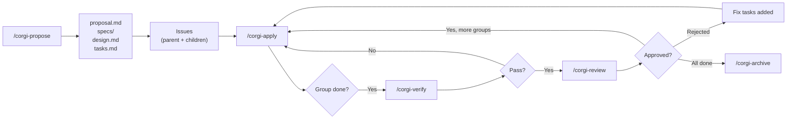
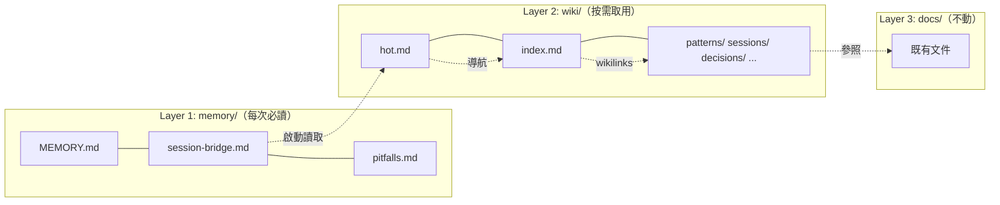
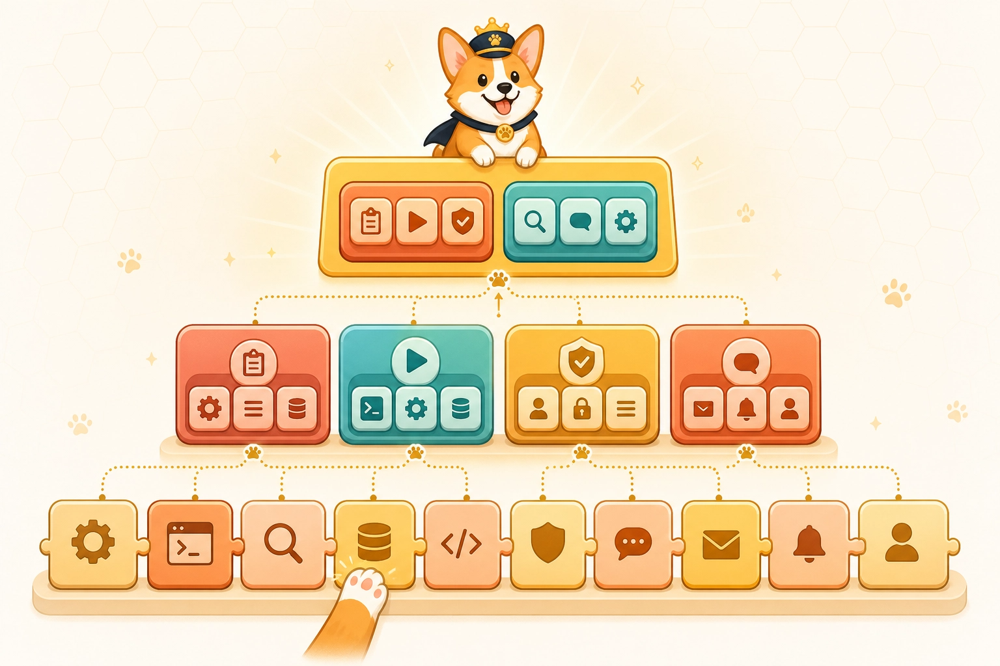

[English](README.md) | **繁體中文**

# 🐕 Coding Corgi Flow

> **你的 AI 管線，結構化。**  
> 一套工作流工具組，把任何 AI coding assistant 變成有紀律的工程夥伴 — 從提案到歸檔，全程追蹤、可審查。

<p align="center">
  
</p>

---

## 🐾 使用前 vs 使用後

<table>
  <tr>
    <td align="center" width="50%"><b>😫 沒有 Corgi</b></td>
    <td align="center" width="50%"><b>🐕 有 Corgi Flow</b></td>
  </tr>
  <tr>
    <td></td>
    <td></td>
  </tr>
  <tr>
    <td align="center">沒有管線、沒有追蹤。<br/>程式碼混亂、重複犯錯。</td>
    <td align="center">Schema 驅動規劃、Issue 追蹤。<br/>Checkpoint 執行、五軸審查。</td>
  </tr>
</table>

## 🗺️ 管線流程

<p align="center">
  
</p>

<details>
<summary>精確流程圖（Mermaid）</summary>



</details>

---

## 🔧 這是什麼

Coding Corgi Flow 是 [OpenSpec](https://github.com/Fission-AI/OpenSpec)（由 [Fission AI](https://github.com/Fission-AI) 開發的開源 CLI）的 **社群擴充版**。我們在 OpenSpec 的核心 artifact pipeline 之上疊加 custom schemas、AI skills 與 CLI 工具鏈，加入真實團隊需要的功能：

| 超能力 | 為什麼你需要 |
|---|---|
| 📌 **自動 Issue 追蹤** | GitLab 或 GitHub 上自動建立 parent/child issue，標籤同步 |
| 🛑 **Checkpoint 式 Apply** | 一次一個 Task Group — 永遠不會讓 AI 失控 |
| ✅ **自動驗證關卡** | Lint、build、tests、spec coverage — 未通過就阻擋 review |
| 🔍 **五軸審查** | 架構 · 安全 · 效能 · 品質 · 完整度 |
| 🧠 **跨 Session 記憶** | 三層系統 — AI 能在多次 session 間記住上下文（啟動 ≤3000 token） |
| 🌿 **Worktree 隔離** | 平行處理多個 change，各自在獨立 git worktree（opt-in） |
| 🧩 **可組合 Skill** | Atoms → Molecules → Compounds，附帶驗證過的 metadata |
| 📦 **一行指令安裝** | `npm i -g corgispec` → `corgispec bootstrap` → 完成 |

以 npm CLI（`corgispec`）、Claude Code / Codex plugin，以及 OpenCode、Claude Code、Codex 的 slash command 形式發佈。

---

## 🚀 快速開始

### 先決條件

- **Node.js 18+**
- **LLM Agent** — OpenCode、Claude Code、Cursor、AmpCode 等
- **`gh` CLI**（GitHub）或 **`glab` CLI**（GitLab）

### 安裝與 Bootstrap

選一條路：

**A. npm（推薦）**

```bash
npm install -g corgispec
corgispec bootstrap --path /path/to/your-project --schema github-tracked
```

**B. Claude Code / Codex Plugin**

```text
# Claude Code
/plugin marketplace add ricoyudog/Coding_Corgi_flow
/plugin install corgispec@corgispec

# Codex
codex plugin install corgispec
```

**C. 透過 AI Agent Bootstrap**

把這段貼進你的 agent：

```text
Fetch and follow instructions from https://raw.githubusercontent.com/ricoyudog/Coding_Corgi_flow/main/.opencode/INSTALL.md
```

### 初始化記憶（建議）

```text
# OpenCode
/corgi-memory-init

# Claude Code
/corgi:memory-init
```

### 開始使用

```text
# OpenCode
/corgi-propose Add user authentication with JWT and refresh tokens

# Claude Code
/corgi:propose Add user authentication with JWT and refresh tokens
```

然後：`apply` → `verify` → `review` → `archive`。一次一個 Task Group。

---

## 🎮 指令

| 指令 | 功能 |
|---|---|
| `/corgi-propose` | 產生規劃 artifact（proposal、specs、design、tasks）+ 建立 issue |
| `/corgi-apply` | 執行一個 Task Group，同步 closeout，暫停等 review |
| `/corgi-verify` | 自動化品質關卡 — lint、build、tests、spec coverage |
| `/corgi-review` | 五軸審查，蒐集證據，approve/reject/discuss |
| `/corgi-archive` | 關閉 issue、同步 delta spec、萃取知識、清理 |
| `/corgi-explore` | 思考夥伴 — 探索想法、釐清需求 |
| `/corgi-install` | 安裝、更新或驗證 project-local 資產 |
| `/corgi-memory-init` | 初始化三層記憶（`memory/` + `wiki/`） |
| `/corgi-migrate` | 將既有知識匯入 memory/wiki |
| `/corgi-lint` | 11 項記憶健康檢查 |
| `/corgi-ask` | 從 vault 中以預算感知檢索回答問題 |

> Claude Code 使用 `/corgi:<command>` 格式（如 `/corgi:propose`）。平台從 `config.yaml` 自動偵測。

---

## ✨ 功能展示

<table>
  <tr>
    <td width="50%">
      <b>📋 Checkpoint 式 Apply</b><br/>
      一次一個 Task Group，暫停等 review — 永遠不會失控。
      <br/><br/>
      
    </td>
    <td width="50%">
      <b>📌 自動 Issue 追蹤</b><br/>
      GitLab 或 GitHub 上自動建立 parent + child issue，標籤同步。
      <br/><br/>
      
    </td>
  </tr>
  <tr>
    <td>
      <b>✅ 任務管理</b><br/>
      任務拆成 group，清晰的 checklist 追蹤。
      <br/><br/>
      
    </td>
    <td>
      <b>🔍 五軸審查</b><br/>
      架構 · 安全 · 效能 · 品質 · 完整度。
      <br/><br/>
      
    </td>
  </tr>
</table>

---

## 🧠 跨 Session 記憶

AI session 預設是無狀態的。Corgi Flow 加入 **三層記憶系統** — 啟動 ≤2900 token、自動壓縮、Obsidian 相容。

<p align="center">
  
</p>

<details>
<summary>精確架構圖（Mermaid）</summary>



</details>

> 📸 實際畫面：

| 情境 | 指令 |
|---|---|
| 新專案 | 貼上 Quick Start prompt → `corgispec bootstrap` |
| 既有專案加入記憶 | `/corgi-memory-init` |
| 遷移既有知識庫 | `/corgi-migrate` |
| 健康檢查 | `/corgi-lint` |

→ **[完整記憶文件](docs/cross-session-memory.zh-TW.md)**

---

## 🧩 Skill 架構

Skills 採用 **可組合的三層階層**：

<p align="center">
  
</p>

| 層級 | 角色 | 相依 |
|---|---|---|
| **Atom** | 單一可複用操作（resolve config、parse tasks） | 無 |
| **Molecule** | 組合 atoms 的工作流（propose、apply、review） | 只能依賴 atoms |
| **Compound** | 端到端編排（完整管線） | 只能依賴 molecules |

每個 skill 有兩個檔案：
- `SKILL.md` — AI 可讀的指令
- `skill.meta.json` — 機器可讀的 metadata（tier、deps、platform、version）

用 `ds-skills` CLI 驗證與視覺化：

```bash
cd tools/ds-skills && npm install
node bin/ds-skills.js validate --path ../..    # schema + tier + cycle 檢查
node bin/ds-skills.js graph --path ../..        # 相依圖譜（Mermaid）
node bin/ds-skills.js list --path ../.. --tier atom --platform github
```

---

## 📐 Schema

Schema 定義 artifact pipeline。兩個內建 schema（`gitlab-tracked`、`github-tracked`）產出相同的 4-artifact 流程：

| 產物 | 檔案 | 用途 |
|---|---|---|
| **提案** | `proposal.md` | 動機、範圍、能力項目、影響 |
| **規格** | `specs/<capability>/spec.md` | 正式 WHEN/THEN 情境（每個 capability 一份） |
| **設計** | `design.md` | 技術決策、架構、風險、取捨 |
| **任務** | `tasks.md` | 附 checkbox 的編號 Task Group — 每個 group 變成 child issue |

流程：`proposal → specs → design → tasks → apply`

關鍵設計：
- **Capability 驅動規格** — 每個 capability 獨立 spec 檔案，可追溯
- **Delta spec 模型** — ADDED/MODIFIED/REMOVED/RENAMED 操作，累積成 canonical spec
- **Task Group 即 checkpoint** — 每個 `## N. Group` = 一個 child issue、一個 apply session、一個 review cycle

<details>
<summary>建立自訂 schema</summary>

建立 `openspec/schemas/my-schema/`：

```
my-schema/
├── schema.yaml
└── templates/
    ├── proposal.md
    └── tasks.md
```

`schema.yaml`：

```yaml
name: my-schema
version: 1
description: 輕量工作流，含提案與任務

artifacts:
  - id: proposal
    generates: proposal.md
    description: 做什麼、為什麼
    template: proposal.md
    instruction: |
      撰寫提案，說明變更動機與範圍。
    requires: []

  - id: tasks
    generates: tasks.md
    description: 實作清單
    template: tasks.md
    instruction: |
      將實作拆成附 checkbox 的編號 Task Group。
    requires:
      - proposal

apply:
  requires:
    - tasks
  tracks: tasks.md
  instruction: |
    一次執行一個 Task Group。完成後將 tasks 標記為 [x]。
```

在 `config.yaml` 設定 `schema: my-schema`。

</details>

---

## ⚖️ 原生 OpenSpec vs. Corgi Flow

| 能力 | 原生 OpenSpec | Coding Corgi Flow |
|---|---|---|
| Issue 追蹤 | 無 | Parent/child issue，透過 `gh` 或 `glab` |
| Apply 行為 | 一次全部 | Checkpoint 式：一個 group、暫停、審查 |
| 進度同步 | 僅本地 checkbox | 豐富摘要發佈到 issue |
| 工作流標籤 | 無 | `backlog → todo → in-progress → review → done` |
| 審查 | 無 | 五軸自動檢查 + verify gate + 決策循環 |
| Spec 格式 | 通用 | Delta 操作（ADDED/MODIFIED/REMOVED/RENAMED） |
| Worktree 隔離 | 無 | 可選平行開發（git worktree） |
| 跨 session 記憶 | 無 | 三層系統，自動壓縮 |
| 知識遷移 | 無 | 從 docs、archives、vault 頁面導入 |
| 記憶健康 | 無 | 11 項 lint（新鮮度、上限、連結、萃取） |
| Skill 架構 | 扁平檔案 | Atoms → Molecules → Compounds + schema 驗證 |
| Plugin 市集 | 無 | Claude Code `/plugin install` + Codex marketplace |

---

## ⚙️ 設定

所有設定在 `openspec/config.yaml`：

```yaml
schema: github-tracked       # 或 gitlab-tracked

# 選填：worktree 隔離，平行處理多個 change
isolation:
  mode: worktree             # worktree | none（預設：none）
  root: .worktrees
  branch_prefix: feat/

# 選填：AI 生成 artifact 的專案 context
context: |
  Tech stack: TypeScript, Next.js 14, Prisma, PostgreSQL
  Domain: 電子商務平台

# 選填：per-artifact 規則
rules:
  proposal:
    - 提案控制在 500 字以內
  tasks:
    - 每個 task 最多 2 小時
```

Installer 只管理 `schema` 和 `isolation` 鍵。`context` 和 `rules` 請自行添加。

完整安裝/更新/驗證參考（全新安裝、受管理更新、本地修改、legacy 遷移），請見下方 [安裝 / 更新 / 驗證參考](#-安裝--更新--驗證參考)。

---

## 📂 儲存庫結構

```
schemas/
└── skill-meta.schema.json            # skill 驗證用 JSON Schema

packages/corgispec/                   # 統一 CLI（npm 發佈用）
├── src/                              # TypeScript 原始碼
├── dist/                             # 建置輸出
└── assets/                           # 內建資產

tools/ds-skills/                      # Skill CLI（舊版，改用 corgispec）
├── bin/ds-skills.js
├── lib/{loader,validate,list,graph}.js
└── tests/

docs/
├── articles/                         # 漫畫、截圖、發佈套件
│   └── images/                       # 功能截圖
├── plans/                            # 設計與規劃文件
└── specs/                            # 功能設計規格

openspec/
├── config.yaml
├── schemas/{gitlab,github}-tracked/  # Schema 定義 + 模板
├── specs/                            # 累積的 canonical spec
└── changes/                          # 進行中的 change 目錄

.opencode/
├── skills/corgispec-*/               # Source of truth：SKILL.md + skill.meta.json
└── commands/corgi-*.md               # Slash command dispatch

.claude/
├── skills/corgispec-*/               # Claude Code skill 鏡像
├── commands/corgi/                   # Claude slash command dispatch
└── settings.json                     # Team auto-install 設定

.claude-plugin/                       # Claude Code Plugin manifest
.codex-plugin/                        # Codex Plugin manifest
.codex/skills/corgispec-*/           # Codex skill symlink → .claude/skills/
```

---

## 📖 文件

| 文章 | 語言 | 說明 |
|---|---|---|
| [跨 Session 記憶](docs/cross-session-memory.zh-TW.md) | 中文 / [EN](docs/cross-session-memory.md) | 架構、生命週期、遷移 |
| [OpenSpec 落地 GitHub](docs/superpowers/articles/2026-04-28-corgispec-github-workflow-zhihu.md) | 中文 | Spec → Issue → Review → Git 管線整合 |

---

## 🤝 如何貢獻

1. Fork 並 clone
2. 在 `.opencode/skills/` 下建立或更新 skill
3. 每個 skill 需要 `SKILL.md`（AI 指令）+ `skill.meta.json`（metadata）
4. 驗證：`node tools/ds-skills/bin/ds-skills.js validate --path .`
5. 本地測試後送出 PR
6. 同步 `.opencode/skills/`、`.claude/skills/`、`.codex/skills/` 三個目錄

---

## 🔧 安裝 / 更新 / 驗證參考

Installer 支援四種模式：

### 全新安裝

目標專案還沒有 managed file：

```text
/corgi-install --mode fresh --path /path/to/your-project
```

複製 managed file 到 `.opencode/`、`.claude/`、`openspec/schemas/`，最小幅度修改 `config.yaml`，寫入 install manifest 與報告。

### 受管理更新

專案已有 `openspec/.corgi-install.json`：

```text
/corgi-install --mode update --path /path/to/your-project
```

若偵測到本地修改，installer 會印出 diff、停止更新、要求手動解決 — 絕不悄悄覆寫你的變更。

### 僅驗證

不修改任何檔案的 health check：

```text
/corgi-install --mode verify --path /path/to/your-project
```

### Legacy 遷移

若 managed file 存在但沒有 install manifest，installer 判定為 legacy，會建立備份並要求確認後才遷移。

---

## 🙏 致謝

建立在 [Fission AI](https://github.com/Fission-AI) 的 [OpenSpec](https://github.com/Fission-AI/OpenSpec) 之上。核心 CLI、artifact pipeline engine、change lifecycle 全部來自 OpenSpec，我們在其上擴充了 custom schema、AI skill、issue 追蹤、記憶系統與審查自動化。

如果覺得有幫助，也請 ⭐ [OpenSpec](https://github.com/Fission-AI/OpenSpec)。

---

## 📸 圖片來源

- **Hero Banner** & **管線插圖** & **架構圖** & **記憶金庫** — AI 生成，依據 [README 視覺升級計畫](wiki/decisions/readme-visual-upgrade.md)
- **柯基漫畫**（chaos、confident、journey、knowledge）— AI 生成，提示詞見 [漫畫工作流指南](docs/articles/corgi-comic-workflow.md)
- **功能截圖** — Coding Corgi Flow 在真實 GitHub/GitLab 專案的實際畫面
