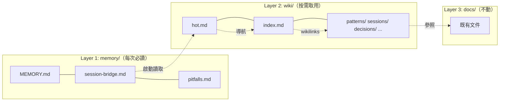

[English](README.md) | **繁體中文**

# 🐕 Coding Corgi Flow

> **你的 AI 管線，結構化。**  
> 一套工作流工具組，把任何 AI coding assistant 變成有紀律的工程夥伴 — 從提案到歸檔，全程追蹤、可審查。

<p align="center">
  
</p>

---

## 🐾 使用前 vs 使用後

<table>
  <tr>
    <td align="center" width="50%"><b>😫 沒有 Corgi</b></td>
    <td align="center" width="50%"><b>🐕 有 Corgi Flow</b></td>
  </tr>
  <tr>
    <td></td>
    <td></td>
  </tr>
  <tr>
    <td align="center">沒有管線、沒有追蹤。<br/>程式碼混亂、重複犯錯。</td>
    <td align="center">Schema 驅動規劃、Issue 追蹤。<br/>Checkpoint 執行、五軸審查。</td>
  </tr>
</table>

## 🗺️ 管線流程

<p align="center">
  
</p>

---

## 🔧 這是什麼

Coding Corgi Flow 是 [OpenSpec](https://github.com/Fission-AI/OpenSpec)（由 [Fission AI](https://github.com/Fission-AI) 開發的開源 CLI）的 **社群擴充版**。我們在 OpenSpec 的核心 artifact pipeline 之上疊加 custom schemas、AI skills 與 CLI 工具鏈，加入真實團隊需要的功能：

| 超能力 | 為什麼你需要 |
|---|---|
| 📌 **自動 Issue 追蹤** | 每個 change 只建立一張 GitLab 或 GitHub Issue，Task Dashboard 自動同步 |
| 🛑 **逐 Group Commit Checkpoint** | Apply 驗證並 commit 每個 Task Group 後才推進 |
| ✅ **自動驗證關卡** | Lint、build、tests、spec coverage — 未通過就阻擋 review |
| 🔍 **五軸審查** | 架構 · 安全 · 效能 · 品質 · 完整度 |
| 🧠 **跨 Session 記憶** | 三層系統 — AI 能在多次 session 間記住上下文（啟動 ≤3000 token） |
| 🌿 **Worktree 隔離** | 平行處理多個 change，各自在獨立 git worktree（opt-in） |
| 🧩 **可組合 Skill** | Atoms → Molecules → Compounds，附帶驗證過的 metadata |
| 🪝 **Session Hooks** | 生命週期 hooks（pre-write、pre-bash、session-start…）搭配 context gates |
| 🔄 **自動化 Apply 管線** | Run Contract v2 管理每個 group 的實作、evidence、review、commit 與 crash 復原 |
| 📦 **一行指令安裝** | `npm i -g corgispec` → `corgispec bootstrap` → 完成 |

以 npm CLI（`corgispec`）、Claude Code / Codex plugin，以及 OpenCode、Claude Code、Codex 的 slash command 形式發佈。

---

## 🚀 快速開始

### 先決條件

- **Node.js >=20.19.0**
- **OpenSpec CLI >=1.6.0 <2.0.0** — CorgiSpec 3 不支援 OpenSpec 1.3–1.5
- **LLM Agent** — OpenCode、Claude Code、Cursor、AmpCode 等
- **`gh` CLI**（GitHub）或 **`glab` CLI**（GitLab），僅在啟用 issue tracking 時需要

### 安裝與 Bootstrap

選一條路：

**A. npm（推薦）**

```bash
npm install -g @fission-ai/openspec@^1.6.0
npm install -g corgispec
corgispec doctor --path /path/to/your-project
corgispec bootstrap --target /path/to/your-project --schema github-tracked
```

未加版本的 `corgispec`、`latest` 與 `next` 都會解析為穩定版 `3.0.1`。若要可重現的安裝，請使用 `npm install -g corgispec@3.0.1` 鎖定版本。

可使用 `--platform <platforms>`（claude、opencode、codex；預設全部）與 `--scope <scope>`（global、local、both；預設 both）。`local` 管理專案 commands、schema、config、manifest 與已存在的 hooks；`global` 管理所選平台的 user-level skills，以及 Claude Code/OpenCode 的 user commands；`both` 會先一起 preflight，再更新兩個範圍。指定 `--platform` 時，只偵測及修復列出的平台。

#### 受管理更新與自動修復

`corgispec bootstrap --mode auto` 與 `--mode update` 會在寫入前偵測所選範圍內完整的 Corgi-managed surface：更新過期的 project commands/schema/config/manifest、同步 user-level skills 與 Claude Code/OpenCode commands、補回遺失的 managed file，並遷移 Corgi 先前安裝的 hooks。完全沒有 Corgi hooks 的專案仍保持 hookless；請使用 `corgispec hooks generate --platform <name>` 明確啟用。

可驗證為 Corgi 產生的 legacy asset 會自動升級。若 managed file 有本地修改、無法解析，或 ownership 不明確，bootstrap 會先備份再停止，不會覆寫。專案備份位於 `openspec/.corgi-backups/<timestamp>/project/`；user-level 備份位於 `~/.corgispec/backups/<timestamp>/<platform>/`。

Hook 遷移會保護各平台自訂內容：Claude Code 保留 permissions、其他 settings 與非 Corgi hooks；OpenCode 合併可辨識的舊 Corgi plugin，保留無關 plugin；Codex 將 legacy hook config 遷移成 TOML 與 Node `.cjs` wrappers，同時保留 MCP、approval、features 與非 Corgi hook 設定。更新後，`corgispec doctor --path <project>` 會分別驗證 Claude Code、OpenCode 與 Codex，避免其中一個平台正常就掩蓋其他平台的舊 hooks。

**B. Claude Code / Codex Plugin**

```text
# Claude Code
/plugin marketplace add ricoyudog/Coding_Corgi_flow
/plugin install corgispec@corgispec

# Codex
codex plugin install corgispec
```

**C. 透過 AI Agent Bootstrap**

把這段貼進你的 agent：

```text
Fetch and follow instructions from https://raw.githubusercontent.com/ricoyudog/Coding_Corgi_flow/master/.opencode/INSTALL.md
```

### 初始化記憶（建議）

```text
# OpenCode
/corgi-memory-init

# Claude Code
/corgi:memory-init
```

### 開始使用

```text
# OpenCode
/corgi-propose Add user authentication with JWT and refresh tokens

# Claude Code
/corgi:propose Add user authentication with JWT and refresh tokens
```

`propose` 返回後，先審閱並明確批准規劃 package。Propose 會在此 handoff 停止；只有後續明確呼叫 `apply` 才能開始實作。Apply 會依序實作、驗證、審查並 commit 每個 Task Group；run 完成後再執行 `human-qa` → `archive`。

---

## 🎮 指令

| 指令 | 功能 |
|---|---|
| `/corgi-propose` | 產生規劃 artifact 與 issue，然後停止並等待實作前的明確審閱 |
| `/corgi-update` | 雙向協調既有規劃 artifact，每次確認一個 artifact 範圍的 diff |
| `/corgi-ready` | Apply 前執行確定性的 planning integrity 檢查 |
| `/corgi-verify` | 自動化品質關卡 — lint、build、tests、spec coverage |
| `/corgi-review` | 五軸審查，蒐集證據，approve/reject/discuss |
| `/corgi-apply` | 唯一實作入口 — 以 CAS 保護逐 Group 實作、evidence、review、commit、復原與 finalize |
| `/corgi-converge` | 比對新鮮的 planning、Git 與 evidence；實作有缺口時，確認後只附加一個 successor Task Group |
| `/corgi-human-qa` | 人工 QA 關卡 — 路由至專業 QA atom（smoke、UI、API、CLI、backend、exploratory） |
| `/corgi-archive` | 關閉 issue、同步 delta spec、萃取知識、清理 |
| `/corgi-explore` | 思考夥伴 — 探索想法、釐清需求 |
| `/corgi-install` | 安裝、更新或驗證 project-local 資產 |
| `/corgi-memory-init` | 初始化三層記憶（`memory/` + `wiki/`） |
| `/corgi-migrate` | 將既有知識匯入 memory/wiki |
| `/corgi-lint` | 14 項記憶健康檢查 |
| `/corgi-ask` | 從 vault 中以預算感知檢索回答問題 |

> Claude Code 使用 `/corgi:<command>` 格式（如 `/corgi:propose`）。平台從 `config.yaml` 自動偵測。

### 3.0 的 Planning Integrity

OpenSpec 1.6 JSON 是 artifact 相依、glob 展開檔案、instructions 與位置的唯一真相來源。Corgi 使用 OpenSpec 回傳的 `planningHome`、`changeRoot`、`artifactPaths` 與 `actionContext`；不再假設 change 位於本地 `openspec/changes/<name>`，也不再寫死 artifact 檔名。因此，透過 OpenSpec Store 選取的 change 可以位於目前 repository 之外。

```bash
# 唯讀的協調 context；實際規劃修改由 skill 顯示並逐一確認。
corgispec update add-auth --json

# 確定性 preflight；--strict 也會把 warning 提升為 blocker。
corgispec ready add-auth --strict --json

# 需要時明確選取 OpenSpec Store。
corgispec ready add-auth --store shared-product --strict --json

# 唯讀 convergence 評估；確認是另一次綁定 token 的呼叫。
corgispec converge add-auth --json
```

經確認的 converge 操作可從 crash 復原。若確認呼叫中斷，以相同的 `confirmationToken` 重跑；CLI 會冪等地恢復 durable intent，且仍是 planning 與 loop state 的唯一 writer。

`ready` 的退出碼：`0` 表示 ready、`1` 表示規劃 blocker、`2` 表示環境或 contract 錯誤。`update` 的退出碼：`0` 表示可開始協調、`1` 表示 active 或待復原的 loop 阻擋規劃修改、`2` 表示 contract 錯誤。在 agent session 中，Claude Code 使用 `/corgi:update`、`/corgi:ready`、`/corgi:converge`；OpenCode 使用對應的 dash 命名指令；Codex 使用已安裝的對應 skills。

---

## ✨ 功能展示

<table>
  <tr>
    <td width="50%">
      <b>📋 逐 Group Apply Checkpoint</b><br/>
      每個 Task Group 都會獨立驗證、審查並 commit，完成後 apply 才會推進。
    </td>
    <td width="50%">
      <b>📌 自動 Issue 追蹤</b><br/>
      每個 change 只建立一張 GitLab 或 GitHub Issue；受管 dashboard 同步 Task Group 與 checkbox，生命週期證據保留在 comments。
    </td>
  </tr>
  <tr>
    <td>
      <b>✅ 任務管理</b><br/>
      任務拆成 group，清晰的 checklist 追蹤。
      <br/><br/>
      
    </td>
    <td>
      <b>🔍 五軸審查</b><br/>
      架構 · 安全 · 效能 · 品質 · 完整度。
      <br/><br/>
      
    </td>
  </tr>
</table>

---

## 🧠 跨 Session 記憶

AI session 預設是無狀態的。Corgi Flow 加入 **三層記憶系統** — 啟動 ≤2900 token、自動壓縮、Obsidian 相容。

<p align="center">
  
</p>

<details>
<summary>精確架構圖（Mermaid）</summary>


```mermaid
flowchart LR
    subgraph "Layer 1: memory/（每次必讀）"
        A["MEMORY.md"] --- B["session-bridge.md"] --- C["pitfalls.md"]
    end
    subgraph "Layer 2: wiki/（按需取用）"
        D["hot.md"] --- E["index.md"] --- F["patterns/ sessions/ decisions/ ..."]
    end
    subgraph "Layer 3: docs/（不動）"
        G["既有文件"]
    end

    B -.->|"啟動讀取"| D
    D -.->|"導航"| E
    E -.->|"wikilinks"| F
    F -.->|"參照"| G
```

</details>

> 📸 實際畫面：

| 情境 | 指令 |
|---|---|
| 新專案 | 貼上 Quick Start prompt → `corgispec bootstrap` |
| 既有專案加入記憶 | `/corgi-memory-init` |
| 遷移既有知識庫 | `/corgi-migrate` |
| 健康檢查 | `/corgi-lint` |

→ **[完整記憶文件](docs/cross-session-memory.zh-TW.md)**

---

## 🪝 Session Hooks

Hooks 讓你對 AI session 擁有 **生命週期控制** — 在執行前驗證上下文、阻擋危險操作、強制記憶壓縮規則。

### CLI 指令

| 指令 | 用途 |
|---|---|
| `corgispec hooks generate --platform <name>` | 為 `claude`、`opencode` 或 `codex` 產生 hook 設定：Claude Code JSON、OpenCode TypeScript plugin，或 Codex TOML 搭配 Node `.cjs` wrappers |
| `corgispec hook <name>` | 呼叫 runtime hook；`name` 可為 `session-start`、`pre-write`、`post-write`、`pre-bash`、`post-compact`、`stop-check`、`loop-check` |

### 可用 Hooks

| Hook | 觸發時機 | 用途 |
|---|---|---|
| `session-start` | Session 開始 | 載入記憶、驗證環境 |
| `pre-write` | 檔案寫入前 | 保護路徑、強制模式 |
| `post-write` | 檔案寫入後 | 觸發 lint、同步鏡像 |
| `pre-bash` | Shell 指令前 | 阻擋破壞性操作、強制白名單 |
| `post-compact` | 上下文壓縮後 | 確保 session-bridge 已更新 |
| `stop-check` | Session 結束前 | 驗證關閉狀態、flush 記憶 |
| `loop-check` | Apply 驅動的 session 結束前 | 檢查 canonical Run Contract v2 state，回傳必須執行的下一個 action |

Claude Code 與 Codex 提供可 awaited 的 lifecycle hook，因此 `stop-check` 或 `loop-check` 非零退出碼可直接阻擋完成。OpenCode 1.18.x 沒有可 awaited 的 stop hook：產生的 plugin 會在 `session.idle` 觀察狀態、保留 hook stdout/stderr，並在尚有工作時透過 `session.promptAsync` 重入互動 session。真正的硬關卡仍是 `corgispec ready` 與 canonical `corgispec loop ...` 狀態轉換。單次 `opencode run` 可能在異步重入完成前就 teardown，所以自動化應明確檢查 ready/loop CLI 結果，不能把 idle 當作完成。

### Context Gates

每個 molecule skill 都包含一個 **context gate** — 結構化的預執行檢查，驗證所需上下文（config、worktree 狀態、issue 參照）存在後才執行。防止在不完整環境中部分執行。

```text
# 範例：corgispec-apply 檢查：
✓ openspec/config.yaml 存在
✓ OpenSpec 解析出唯一的 authoritative change root
✓ 設定的 task artifact 有未完成的 group
✓ Issue tracker 可連線
```

Hooks 是 **opt-in** — 現有專案不需要 hooks 也能正常運作。執行 `corgispec hooks generate --platform <name>` 開始使用。一旦已有 Corgi hooks，`corgispec bootstrap --mode auto|update` 就會偵測並安全遷移所選平台；它不會在 hookless 專案自動啟用 hooks。

---

## 🔄 自動化管線（Apply）

**Corgi Apply 是唯一公開的實作入口。** 它在內部使用 Run Contract v2 loop engine；一次呼叫會驅動所有 Task Group，逐一完成實作、驗證、review evidence 與獨立 commit。

```text
# 一條指令搞定一切：
/corgi:apply <change-name>
```

**功能說明：** 每次呼叫執行一個有邊界的 **Task Group attempt**（實作 → verify → review evidence），再提交給確定性的 Run Contract v2 CLI。Skill 不會直接寫入 lifecycle 檔案；檔案鎖、CAS、event replay、evidence 驗證、commit acknowledgement 與 finalization 都由 CLI 掌控。

| 模式 | 行為 |
|---|---|
| **必要的 Group commit** | 乾淨的 evidence/review → `awaiting_group_commit`；建立一個獨立且匹配的 commit 後才推進 |
| **自動修復迴圈** | 自驅模式失敗且仍有 retry budget → `fixing`；hook-driven 或重試用盡時確定性終止 |
| **Crash 復原** | 將已 fsync 的 event replay 到 atomic snapshot；只有被截斷的最後一筆 JSONL 可自動修復 |

**平台差異：**

| | Claude Code | OpenCode |
|---|---|---|
| 驅動模式 | Hook 驅動（stop-based） | 自驅動（`selfDriven: true`） |
| 失敗處理 | 立即停止 | 自動重試最多 3 次 |
| 指令 | `/corgi:apply <name>` | `/corgi-apply <name>` |

Canonical state 儲存在 `.corgi/loop/<change>/`，每個 run 使用 atomic snapshot 與 append-only event/triage log。每次修改都帶有 `stateRevision + nonce`；stale token 或衝突 session 不會改動檔案系統。

**設計原則：** *Hard Logic Orchestrates, LLM Executes.* CLI 掌控狀態轉換、驗證、evidence identity、檔案鎖、復原與熔斷。LLM skill 只執行有邊界的工作，並透過 CLI 提交真實 evidence。

→ **[完整 Apply 指南](.opencode/skills/compounds/corgispec-apply/SKILL.md)**

---

## 🧩 Skill 架構

Skills 採用 **可組合的三層階層**：

<p align="center">
  
</p>

| 層級 | 角色 | 相依 |
|---|---|---|
| **Atom** | 單一可複用操作（resolve config、parse tasks） | 無 |
| **Molecule** | 組合 atoms 的工作流（propose、verify、review） | 只能依賴 atoms |
| **Compound** | 端到端編排（完整管線） | 只能依賴 molecules |

每個 skill 有兩個檔案：
- `SKILL.md` — AI 可讀的指令
- `skill.meta.json` — 機器可讀的 metadata（tier、deps、platform、version）

用 `ds-skills` CLI 驗證與視覺化：

```bash
cd tools/ds-skills && npm install
node bin/ds-skills.js validate --path ../..    # schema + tier + cycle 檢查
node bin/ds-skills.js graph --path ../..        # 相依圖譜（Mermaid）
node bin/ds-skills.js list --path ../.. --tier atom --platform github
```

---

## 📐 Schema

Schema 定義 artifact pipeline。CorgiSpec 接受任何 OpenSpec schema 名稱，並遵循 OpenSpec 回傳的 artifact graph 與路徑。兩個內建 schema（`gitlab-tracked`、`github-tracked`）產出以下相同的 4-artifact 流程：

| 產物 | 檔案 | 用途 |
|---|---|---|
| **提案** | `proposal.md` | 動機、範圍、能力項目、影響 |
| **規格** | `specs/<capability>/spec.md` | 正式 WHEN/THEN 情境（每個 capability 一份） |
| **設計** | `design.md` | 技術決策、架構、風險、取捨 |
| **任務** | `tasks.md` | 附 checkbox 的編號 Task Group，同步到單一 Issue dashboard |

流程：`proposal → specs → design → tasks → apply`

關鍵設計：
- **Capability 驅動規格** — 每個 capability 獨立 spec 檔案，可追溯
- **Delta spec 模型** — ADDED/MODIFIED/REMOVED/RENAMED 操作，累積成 canonical spec
- **Task Group 即 checkpoint** — 每個 `## N. Group` = 一個 dashboard 區段、一個 apply checkpoint、一個獨立 commit

<details>
<summary>建立自訂 schema</summary>

建立 `openspec/schemas/my-schema/`：

```
my-schema/
├── schema.yaml
└── templates/
    ├── proposal.md
    └── tasks.md
```

`schema.yaml`：

```yaml
name: my-schema
version: 1
description: 輕量工作流，含提案與任務

artifacts:
  - id: proposal
    generates: proposal.md
    description: 做什麼、為什麼
    template: proposal.md
    instruction: |
      撰寫提案，說明變更動機與範圍。
    requires: []

  - id: tasks
    generates: tasks.md
    description: 實作清單
    template: tasks.md
    instruction: |
      將實作拆成附 checkbox 的編號 Task Group。
    requires:
      - proposal

apply:
  requires:
    - tasks
  tracks: tasks.md
  instruction: |
    一次執行一個 Task Group。完成後將 tasks 標記為 [x]。
```

在 `config.yaml` 設定 `schema: my-schema`。

</details>

---

## ⚖️ 原生 OpenSpec vs. Corgi Flow

| 能力 | 原生 OpenSpec | Coding Corgi Flow |
|---|---|---|
| Issue 追蹤 | 無 | 每個 change 一張 Issue，透過 `gh` 或 `glab` |
| 實作行為 | 一次全部 | Apply 逐一驗證、審查並 commit 每個 group，再自動推進 |
| 進度同步 | 僅本地 checkbox | 一個受管 dashboard 加生命週期 comments |
| 工作流標籤 | 無 | `backlog → todo → in-progress → review → done` |
| 審查 | 無 | 五軸自動檢查 + verify gate + 決策循環 |
| 人工 QA | 無 | 結構化 QA，含 6 個專業 atom（smoke、UI、API、CLI、backend、exploratory） |
| Spec 格式 | 通用 | Delta 操作（ADDED/MODIFIED/REMOVED/RENAMED） |
| Worktree 隔離 | 無 | 可選平行開發（git worktree） |
| 跨 session 記憶 | 無 | 三層系統，自動壓縮 |
| 知識遷移 | 無 | 從 docs、archives、vault 頁面導入 |
| 記憶健康 | 無 | 14 項 lint（新鮮度、上限、連結、萃取） |
| Skill 架構 | 扁平檔案 | Atoms → Molecules → Compounds + schema 驗證 |
| Session hooks | 無 | 生命週期 hooks（pre-write、pre-bash、session-start…）+ context gates |
| 自動化管線 | 無 | Run Contract v2：每個 group 的 CAS、evidence、review、commit acknowledgement 與 crash 復原 |
| Plugin 市集 | 無 | Claude Code `/plugin install` + Codex marketplace |

---

## ⚙️ 設定

所有設定在 `openspec/config.yaml`：

```yaml
schema: product-delivery     # 任何已安裝的 OpenSpec schema

# 選填：Corgi 專用設定
corgi:
  tracking:
    provider: github         # github | gitlab | none
  taskArtifactId: tasks      # 含可執行 Task Group 的 artifact

# 選填：worktree 隔離，平行處理多個 change
isolation:
  mode: worktree             # worktree | none（預設：none）
  root: .worktrees
  branch_prefix: feat/

# 選填：AI 生成 artifact 的專案 context
context: |
  Tech stack: TypeScript, Next.js 14, Prisma, PostgreSQL
  Domain: 電子商務平台

# 選填：per-artifact 規則
rules:
  proposal:
    - 提案控制在 500 字以內
  tasks:
    - 每個 task 最多 2 小時
```

`schema` 現在只選擇 OpenSpec workflow，不再選擇 issue tracker。只有 schema 確實提供 id 為 `tasks` 的 artifact 時，才能省略 `corgi.taskArtifactId`。Task Group 檢查與 ready 要求該 artifact 解析成唯一一個具體檔案。Installer 會保留專案自行維護的 `context` 與 `rules`。

### 從 CorgiSpec 2.x 遷移

1. 升級至 Node >=20.19.0 與 OpenSpec >=1.6.0 <2.0.0，再安裝 `corgispec`（穩定版 `3.0.1`），或精確鎖定 `corgispec@3.0.1`。`latest` 與 `next` 會解析為相同的穩定版本。
2. 保留既有 schema 名稱，但明確寫出原先推斷的 tracker：

   ```yaml
   schema: github-tracked
   corgi:
     tracking:
       provider: github
     taskArtifactId: tasks
   ```

   `gitlab-tracked` 請使用 `gitlab`；不需要 issue integration 時使用 `none`。遷移期間仍可讀取 legacy 推斷，`corgispec doctor` 會提示建議修改。
3. 執行 `corgispec doctor --path .`，再對每個 active change 執行 `corgispec ready <change> --strict --json`。所有 blocker 解決後才能 apply。
4. 若 change 屬於 Store，lifecycle command 都要加上 `--store <id>`，且只能使用 JSON 回傳的 authoritative path。

OpenSpec 1.3–1.5 無法作為 fallback。若 doctor 回報 `openspec_version_unsupported`，請先升級 OpenSpec。

完整安裝/更新/驗證參考（全新安裝、受管理更新、本地修改、legacy 遷移），請見下方 [安裝 / 更新 / 驗證參考](#-安裝--更新--驗證參考)。

---

## 📂 儲存庫結構

```
schemas/
└── skill-meta.schema.json            # skill 驗證用 JSON Schema

packages/corgispec/                   # 統一 CLI（npm 發佈用）
├── src/                              # TypeScript 原始碼
├── dist/                             # 建置輸出
└── assets/                           # 內建資產

tools/ds-skills/                      # Skill CLI（舊版，改用 corgispec）
├── bin/ds-skills.js
├── lib/{loader,validate,list,graph}.js
└── tests/

docs/
├── articles/                         # 漫畫、截圖、發佈套件
│   └── images/                       # 功能截圖
├── plans/                            # 設計與規劃文件
└── specs/                            # 功能設計規格

openspec/
├── config.yaml
├── schemas/{gitlab,github}-tracked/  # Schema 定義 + 模板
├── specs/                            # 累積的 canonical spec
└── changes/                          # 進行中的 change 目錄

.opencode/
├── skills/corgispec-*/               # Source of truth：SKILL.md + skill.meta.json
└── commands/corgi-*.md               # Slash command dispatch

.claude/
├── skills/corgispec-*/               # Claude Code skill 鏡像
├── commands/corgi/                   # Claude slash command dispatch
└── settings.json                     # Team auto-install 設定

.claude-plugin/                       # Claude Code Plugin manifest
.codex-plugin/                        # Codex Plugin manifest
.codex/skills/corgispec-*/           # Codex skill symlink → .claude/skills/
```

---

## 📖 文件

| 文章 | 語言 | 說明 |
|---|---|---|
| [跨 Session 記憶](docs/cross-session-memory.zh-TW.md) | 中文 / [EN](docs/cross-session-memory.md) | 架構、生命週期、遷移 |
| [OpenSpec 落地 GitHub](docs/superpowers/articles/2026-04-28-openspec-github-workflow-zhihu.md) | 中文 | Spec → Issue → Review → Git 管線整合 |

---

## 🤝 如何貢獻

1. Fork 並 clone
2. 在 `.opencode/skills/` 下建立或更新 skill
3. 每個 skill 需要 `SKILL.md`（AI 指令）+ `skill.meta.json`（metadata）
4. 驗證：`node tools/ds-skills/bin/ds-skills.js validate --path .`
5. 本地測試後送出 PR
6. 同步 `.opencode/skills/`、`.claude/skills/`、`.codex/skills/` 三個目錄

---

## 🔧 安裝 / 更新 / 驗證參考

Installer 支援四種模式：

### 全新安裝

目標專案還沒有 managed file：

```text
/corgi-install --mode fresh --path /path/to/your-project
```

複製 managed file 到 `.opencode/`、`.claude/`、`openspec/schemas/`，最小幅度修改 `config.yaml`，寫入 install manifest 與報告。

### 受管理更新

專案已有 `openspec/.corgi-install.json`：

```text
/corgi-install --mode update --path /path/to/your-project
```

完整的 CLI 更新可執行 `corgispec bootstrap --target /path/to/your-project --mode update`。Bootstrap 會先 preflight 所選的全部 managed surface、補回遺失檔案、升級可辨識的 legacy asset，並更新已存在的 hook installation。若偵測到本地修改、無效的 structured config，或 ownership 不明確，它會建立對應的 project 或 user-level 備份並停止，等待手動處理 — 絕不悄悄覆寫你的變更。

### 僅驗證

不修改任何檔案的 health check：

```text
/corgi-install --mode verify --path /path/to/your-project
```

### Legacy 遷移

Bootstrap 能辨識 legacy manifest 與已知的 Corgi-generated file。具有可驗證 Corgi signature 的 asset 會自動遷移到目前的 manifest 與 generated format；未知或模糊的 asset 會先備份並停止更新，不會被刪除或取代。

---

## 🙏 致謝

建立在 [Fission AI](https://github.com/Fission-AI) 的 [OpenSpec](https://github.com/Fission-AI/OpenSpec) 之上。核心 CLI、artifact pipeline engine、change lifecycle 全部來自 OpenSpec，我們在其上擴充了 custom schema、AI skill、issue 追蹤、記憶系統與審查自動化。

如果覺得有幫助，也請 ⭐ [OpenSpec](https://github.com/Fission-AI/OpenSpec)。

---

## 📸 圖片來源

- **Hero Banner** & **管線插圖** & **架構圖** & **記憶金庫** — 為此專案 AI 生成
- **柯基漫畫**（chaos、confident、journey、knowledge）— 為專案文章 AI 生成
- **功能截圖** — Coding Corgi Flow 在真實 GitHub/GitLab 專案的實際畫面
