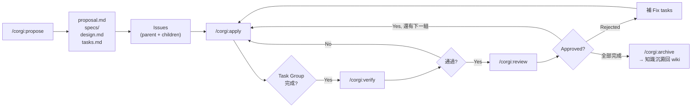
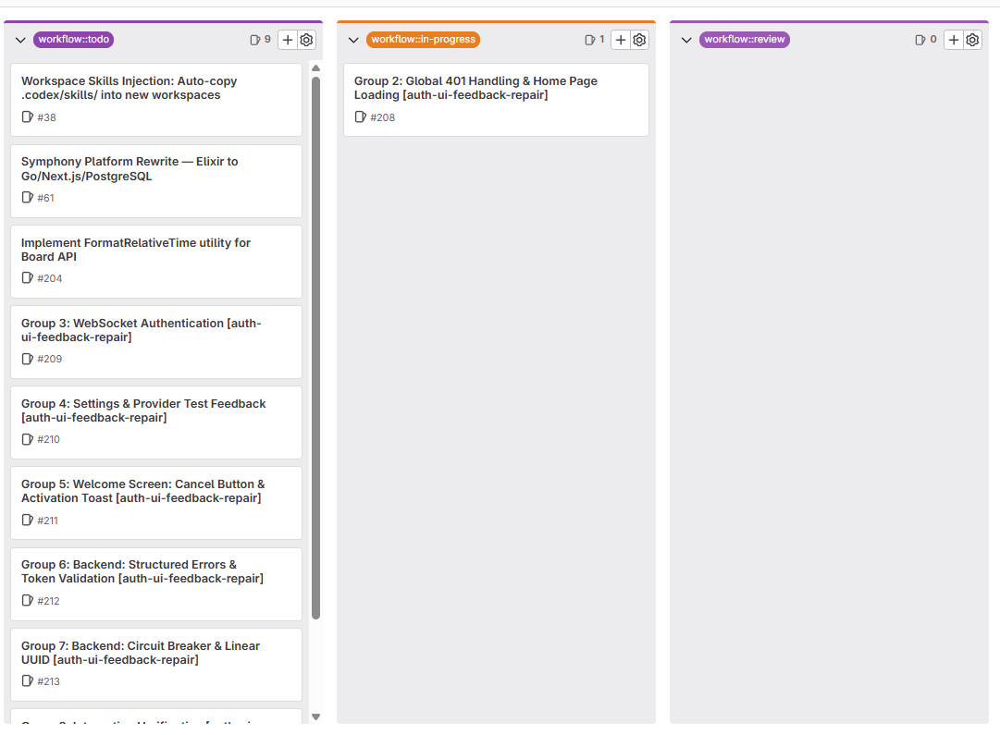
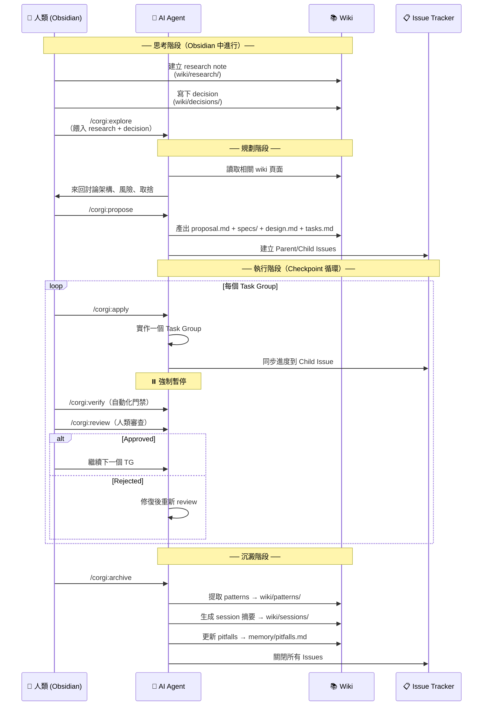
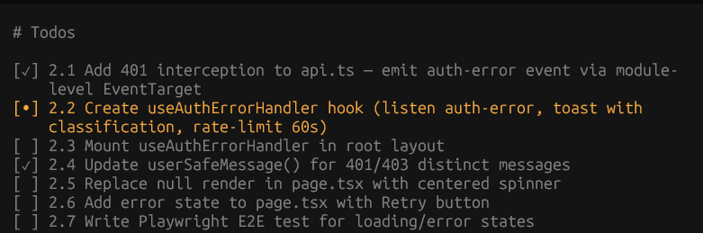
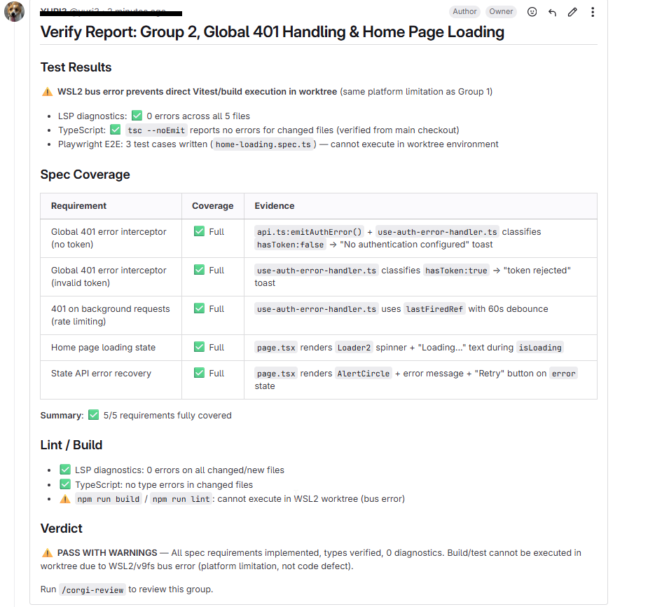
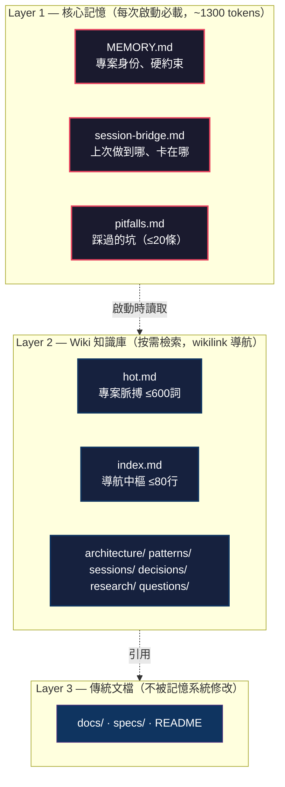
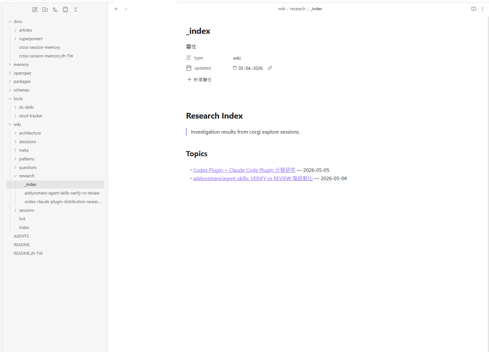
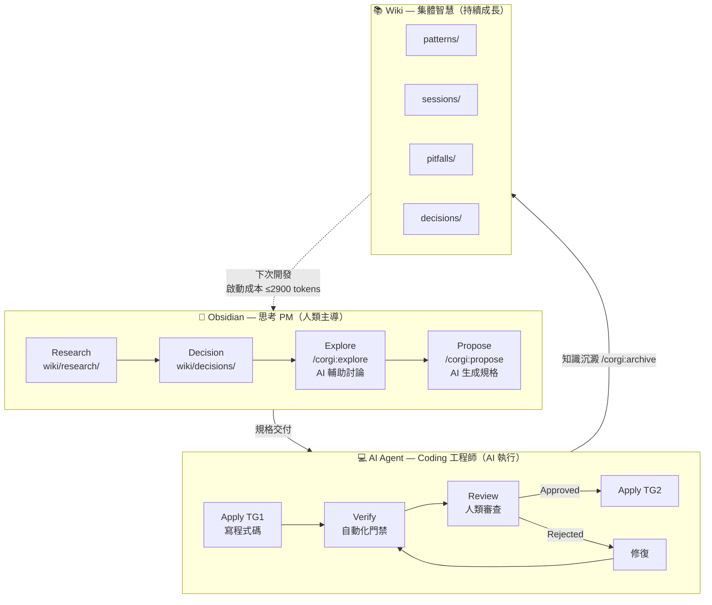

# Obsidian 做思考 PM，AI Agent 做程式開發：一套「人類策展、AI 執行」的開發工作流

> 把 Obsidian 變成你的技術長辦公室，讓 AI agent 當你的紀律嚴明的工程師——這不是科幻，是我們正在用的日常流程。

> **[Coding Corgi Flow](https://github.com/ricoyudog/Coding_Corgi_flow) 是一個基於 OpenSpec 的開源工具鏈。如果你覺得這篇文章有啟發，歡迎去 GitHub 給我們一個 ⭐ Star——這是對開源專案最實在的支持！**

---

## 一、那個所有 AI Coder 都有的痛

你用過 Cursor、Claude Code、或任何 AI coding agent 嗎？

如果是，你大概經歷過這種循環：

- 第一個月：**太神了**，一個 prompt 就生出整個功能，感覺自己像在開外掛
- 第三個月：**怪怪的**，AI 開始忘掉上禮拜你們討論過的設計決策，同一個坑踩三次
- 第六個月：**不敢用了**，專案變成一團「AI 義大利麵」，沒有人（包括你自己）知道為什麼那段程式碼長那樣

核心問題不是 AI 不夠聰明。**核心問題是 AI 沒有記憶，而你把「思考」和「執行」全丟給了同一個無狀態的黑盒子。**

---

## 二、LLM Wiki 給的啟發：從「解釋器」到「編譯器」

Andrej Karpathy（前 Tesla AI 總監、OpenAI 共同創辦人）提出過一個叫 **LLM Wiki** 的設計模式，裡面有一個極其關鍵的洞見：

> 傳統 RAG 就像一個**解釋器**——每次查詢都從原始文檔重新推導答案，無狀態、無積累。
> LLM Wiki 則是一個**編譯器**——先把知識預先「編譯」進一個持久化的 wiki，每次新的輸入都能受益於之前所有輸入的提煉。

| | 解釋器模型（傳統 RAG） | 編譯器模型（LLM Wiki） |
|---|---|---|
| 知識狀態 | 無狀態，每次都從零開始 | 有狀態，wiki 持續成長 |
| 第 100 次查詢 | 和第 1 次一樣貴 | 受益於前 99 次的提煉 |
| 人類角色 | 被動提問者 | 主動策展人 |

這個「編譯器模型」是整篇文章的哲學根基。接下來的問題是：**怎麼把它從「知識管理」延伸到「軟體開發」？**

---

## 三、核心想法：Obsidian 是你的思考 PM，Corgi-flow 是你的 Coding 工程師

我們的答案是一個基於 OpenSpec 的開源工具鏈——[Coding Corgi Flow](https://github.com/ricoyudog/Coding_Corgi_flow)（簡稱 Corgi-flow），它的設計理念可以用一句話概括：

> **Obsidian 是「思考 PM」——人類在這裡研究、決策、策展知識。**
> **AI Agent 是「開發工程師」——拿到明確規格後，紀律嚴明地執行程式開發，並把學到的東西沉澱回 wiki。**

換句話說：**把「想什麼」和「做什麼」拆開。人類負責前者，AI 負責後者，中間用一套 checkpoint 機制確保品質。**

### 為什麼是 Obsidian？

Obsidian 不是一個普通的筆記軟體。它的 `[[wikilinks]]`、local-first Markdown、graph view、和 plugin 生態，讓它成為一個理想的**思考作業系統**：

- 你可以在這裡做 research，建立 `[[wiki/research/]]` 筆記
- 你可以在這裡做決策，寫下 `[[wiki/decisions/]]`
- 你可以用 graph view 看到知識之間的關聯
- **最重要的是：這些 Markdown 檔案同時也是 AI 可以讀取的 context**

Obsidian 就是你的「第二大脑」——但這個大脑不只給你自己用，也給你的 AI 工程師用。

> 📸 **截圖建議 #1**：放一張 Obsidian 的 **Graph View** 截圖，展示 `wiki/research/`、`wiki/decisions/`、`wiki/patterns/` 之間的關聯圖。節點之間用 `[[wikilinks]]` 相連。（⏳ 待截圖）

---

## 四、技術基底：我們站在 OpenSpec 的肩膀上

前面講了理念，現在講實作。這套工作流的技術基底是 **[OpenSpec](https://github.com/Fission-AI/OpenSpec)**——由 Fission AI 開發的開源 CLI，專門管理 AI 輔助開發中的 change artifacts（proposals、specs、designs、tasks）。

OpenSpec 本身提供了一個簡潔的核心理念：**每次改動都是一個「change」，每個 change 產出四個 artifacts**：

```
proposal.md  →  specs/  →  design.md  →  tasks.md
   (為什麼做)     (做什麼)     (怎麼做)      (分幾步做)
```

但原生 OpenSpec 有一個缺口：它定義了 artifacts 的**結構**，卻沒有定義開發的**流程**。它不會幫你建 Issue、不會在每個階段暫停讓你 review、不會記住上次開發學到的教訓。

**所以我們在 OpenSpec 之上，加了五樣東西：**

| 原生 OpenSpec | Corgi-flow 加的 |
|-------------|----------------|
| ❌ 無 Issue Tracking | ✅ GitLab/GitHub 自動建立 Parent/Child Issues |
| ❌ Apply 一次做完所有任務 | ✅ Checkpoint 機制：一次一個 Task Group，強制暫停 |
| ❌ 無 Review 門禁 | ✅ Verify（自動化）+ Review（人類 5 軸審查） |
| ❌ 每次 session 從零開始 | ✅ 3 層跨會話記憶，啟動成本 ≤ 2900 tokens |
| ❌ 無知識沉澱 | ✅ Archive 時自動提取 patterns 寫回 wiki |

用一句話總結：**OpenSpec 定義了「要產出什麼」，Corgi-flow 定義了「怎麼產出、誰來把關、學到什麼」。**





> 💡 上圖：GitLab Issue Board，一個 change 的 parent issue + 多個 child issues（每個對應一個 Task Group），labels 顯示 `backlog → todo → in-progress → review → done` 的狀態流轉。這就是「checkpoint」的具體呈現。

---

## 五、完整工作流：一個需求的五階段旅程

讓我們跟蹤一個真實需求的完整生命週期。下面是整個流程的全景圖：



### 階段 0：人類 Research（在 Obsidian 中）

你想做一個「使用者權限管理模組」。你不急著叫 AI 寫 code。你先在 Obsidian 裡開一個 research note。

你收集參考資料：業界最佳實踐（RBAC vs ABAC）、公司現有系統的限制、競品是怎麼做的。你把這些整理成 `wiki/research/permission-system-design.md`。

這一步**沒有任何 AI 參與**。你是策展人，你在建立 `raw/` 層的原始材料。

> 可選：用 `/corgi:ask` 讓 AI 幫你從 vault 中檢索相關的既有筆記（預算限制：≤2 個 wiki 頁面，不會無限展開）。

### 階段 1：人類 Decision（在 Obsidian 中）

研究做完了，你要做一個決定。你寫下 `wiki/decisions/permission-rbac-choice.md`：

```markdown
---
type: decision
phase: pre-explore
status: accepted
---

# 決策：採用 RBAC 而非 ABAC

## 理由
- 團隊規模 < 50 人，ABAC 的複雜度收益不成比例
- 現有系統已有 role 的雛形，遷移成本低
- 時間限制：Q3 必須上線

## 取捨
- 犧牲了屬性級控制的彈性
- 若未來需要 ABAC，需重構權限層
```

這一步是**純人類判斷**。AI 不能替你做取捨——它不知道你的團隊政治、你的時間壓力、你的風險偏好。

> 📸 **截圖建議 #3**：放一張 Obsidian editor 的截圖，展示 decision note 的實際樣子（YAML frontmatter + markdown 內容）。（⏳ 待截圖）

### 階段 2：AI Explore（`/corgi:explore`）

現在你有了明確的方向。你把 decision note 餵給 `/corgi:explore`：

```
/corgi:explore

我想實作 RBAC 權限系統。這是我的 research 和 decision：
[[wiki/research/permission-system-design]]
[[wiki/decisions/permission-rbac-choice]]

幫我想清楚：架構上要改哪些模組？有哪些潛在的坑？和現有 auth 系統怎麼對接？
```

AI 進入**思考夥伴模式**——它會探索你的 codebase、讀取相關的 wiki 頁面、和你來回討論。這個階段**不寫程式碼**，只產出理解和分析。

Explore 的產出會被寫入 `wiki/research/`（如果產生了新的 insights）。

### 階段 3：AI Propose（`/corgi:propose`）

討論夠了，現在 AI 把結論正規化成 OpenSpec 的四大 artifacts：

```
proposal.md     ← 為什麼要做、做什麼、影響範圍
specs/          ← 每個 capability 的形式化規格（WHEN/THEN 場景）
design.md       ← 技術決策、架構、風險、取捨
tasks.md        ← 編號的 Task Group，每個有 checkbox
```

這一步的關鍵：**propose 的品質取決於前面 research + decision + explore 的深度。** AI 不是在猜你要什麼——它已經從你的筆記中理解了 context。



> 💡 上圖：`tasks.md` 在 Obsidian 中的樣子。每個 `## N. Group Name` 就是一個 checkpoint——一次 `/corgi:apply` 的執行單位。

### 階段 4：AI Apply（`/corgi:apply`）—— Checkpoint 執行

這是 Corgi-flow 最核心的創新：**一次只執行一個 Task Group，完成後強制暫停**。

```
/corgi:apply
→ 執行 Task Group 1: 「資料模型與 Migration」
→ 完成，同步進度到 GitLab/GitHub Issue
→ 暫停 ⏸️ 等待人類 review
```

為什麼要暫停？因為：

1. **防止 AI 一路狂飆到錯誤的方向**——如果 TG1 的資料模型設計有問題，TG2-5 全部要重寫
2. **每一段都是可回溯的 checkpoint**——出問題時你知道從哪個點修正
3. **人類保持控制權**——你不是把整個專案丟給 AI 然後祈禱

然後進入 **Verify**（自動化門禁：lint、build、tests、spec coverage）→ **Review**（人類 5 軸審查：架構、安全、效能、程式碼品質、完整性）→ approve or reject。

通過後才進入下一個 Task Group。




> 💡 上兩圖：Task Group 執行完的 checkpoint closeout，以及同步到 Issue 的詳細進度回報。這就是「流程紀律」——不是一口氣做完，而是一段一段、每段都要人類看過。

### 階段 5：Archive + 知識沉澱（`/corgi:archive`）

所有 Task Group 完成後，不是「收工下班」。Archive 階段會做一件 LLM Wiki 哲學中最重要的事：

> **把這次開發中學到的東西，沉澱回 wiki。**

```
/corgi:archive
→ 從這次 change 中提取可複用的 patterns → wiki/patterns/
→ 生成這次 session 的摘要 → wiki/sessions/
→ 把 delta spec 同步進 canonical specs → openspec/specs/
→ 更新 pitfalls（踩過的坑）→ memory/pitfalls.md
→ 更新 project pulse → wiki/hot.md
```

這樣，**下一次開發時，AI 啟動只需要讀 ~2900 tokens 就能恢復全部 context**——不需要重新討論、不需要重複踩坑。

這就是「編譯器模型」在軟體開發中的實踐：每一次 change 都讓整個系統更聰明。

---

## 六、3 層記憶架構：為什麼 AI 能「記住」？

在 LLM Wiki 的理念裡，`raw/` + `wiki/` + `CLAUDE.md` 構成了三層知識架構。Corgi-flow 把同樣的思路落地到軟體開發場景：



| 檔案 | 定位 | 硬上限 | 溢出行為 |
|------|------|--------|---------|
| `memory/MEMORY.md` | 專案身份、不可變約束 | 無（寫一次） | — |
| `memory/session-bridge.md` | 上次 session 交接狀態 | 50 行 | 歸檔舊的 Done 項目 |
| `memory/pitfalls.md` | 跨 change 踩坑記錄 | 20 條 active | 輪換最舊 10 條到 Archive |
| `wiki/hot.md` | 專案當前狀態快照 | 600 詞 | 修剪最舊條目 |
| `wiki/index.md` | 導航中樞 | 80 行 | 歸檔已完成條目 |

關鍵設計：**不需要 cron、不需要 daemon**。AI 在寫入時自我執行硬上限——這是因為 skill 沒有 runtime，只能靠 agent 自律。`/corgi:lint` 提供事後驗證（11 項檢查）。



> 💡 上圖：Obsidian file explorer 中的 `memory/` 和 `wiki/`。整個記憶系統就是一堆 Markdown 檔案——AI 啟動時讀 `session-bridge.md` + `hot.md` + `index.md`，成本 ≤ 2900 tokens。人類可以隨時打開閱讀、編輯、糾正。沒有黑魔法。

---

## 七、分工一覽



---

## 八、為什麼這件事重要

我們正在經歷一場軟體開發範式的轉移。AI coding agent 不是「比較聰明的 auto-complete」——它們是**一種新的工程資源**，就像 20 年前的 CI/CD 或 15 年前的雲端運算。

但新資源需要新的流程。把 AI 當成一個「什麼都懂但什麼都記不住的天才工程師」來管理，你需要：

1. **明確的規格**（不是模糊的 prompt，是 formal 的 spec）
2. **Checkpoint 機制**（不能讓它一次做完所有事）
3. **人類守門員**（verify 可以自動化，review 必須有人類 approve/reject）
4. **知識沉澱系統**（每次做完要留下紀錄，不能每次都從零開始）

Corgi-flow 做的就是把這四件事**工程化**——站在 OpenSpec 的 artifact 規範之上，補上流程紀律與記憶系統。

Obsidian 做的則是把**人類的思考過程**結構化——讓它不再是「靈光一閃」，而是可追溯、可復用、可交給 AI 理解的決策脈絡。

---

## 九、開始使用

```bash
# 在你的專案中安裝 Corgi-flow（Claude Code）
/plugin marketplace add ricoyudog/Coding_Corgi_flow
/plugin install corgispec@corgispec

# 或使用 bootstrap 安裝（適用於任何 LLM agent）
# 複製以下 prompt 給你的 agent：
# Fetch and follow instructions from
# https://raw.githubusercontent.com/ricoyudog/Coding_Corgi_flow/main/.opencode/INSTALL.md
```

然後在你的 Obsidian vault（就是你的專案目錄）中初始化記憶系統：

```
/corgi:memory-init
```

從此：
- 你的 **Obsidian** 不再只是筆記軟體——它是你的思考 PM 辦公室
- 你的 **AI agent** 不再是一個健忘的黑盒子——它是你的紀律嚴明的開發團隊
- 你的 **wiki** 不再是一堆過期的文件——它是隨著每次開發持續成長的集體智慧

---

## 十、寫在最後

Karpathy 說 LLM Wiki 的精髓是「把 RAG 從解釋器升級成編譯器」。

我們在 OpenSpec 的基礎上更進一步：**把 AI 輔助開發從「對黑盒子許願」升級成「人類策展、AI 執行、wiki 沉澱」的正向循環。**

人類最擅長的是判斷、取捨、創意、理解脈絡。AI 最擅長的是大量執行、絕不抱怨重複工作、嚴格的流程紀律。

把前者留在 Obsidian 裡，把後者交給 Corgi-flow——這才是 AI 時代軟體開發該有的樣子。

---

*Coding Corgi Flow 是一個開源專案，基於 [OpenSpec](https://github.com/Fission-AI/OpenSpec) (Fission AI) 構建。歡迎 star、試用、貢獻：*

👉 [github.com/ricoyudog/Coding_Corgi_flow](https://github.com/ricoyudog/Coding_Corgi_flow)

---

**#AI開發 #Obsidian #OpenSpec #LLM #軟體工程 #CorgiFlow #第二大脑**
